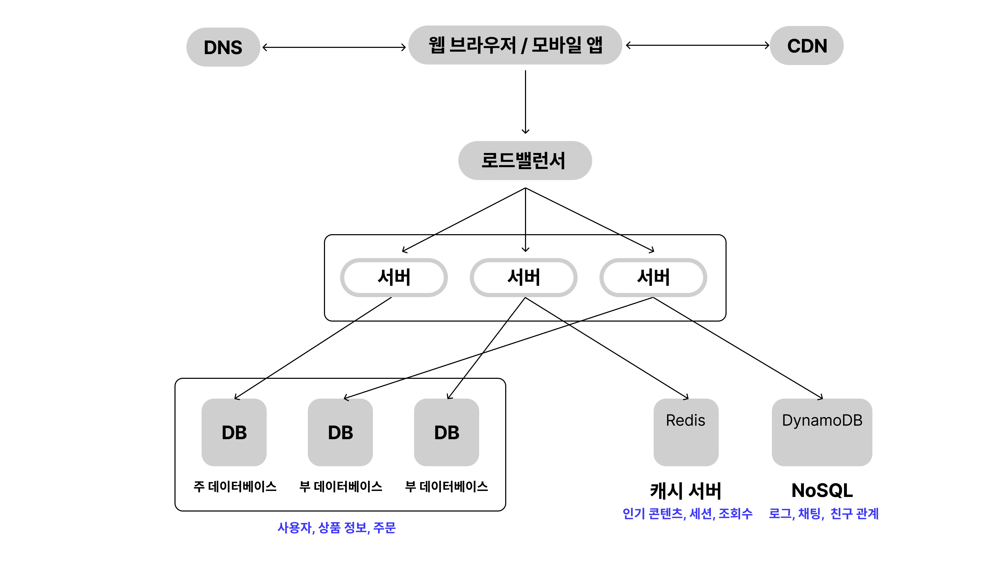
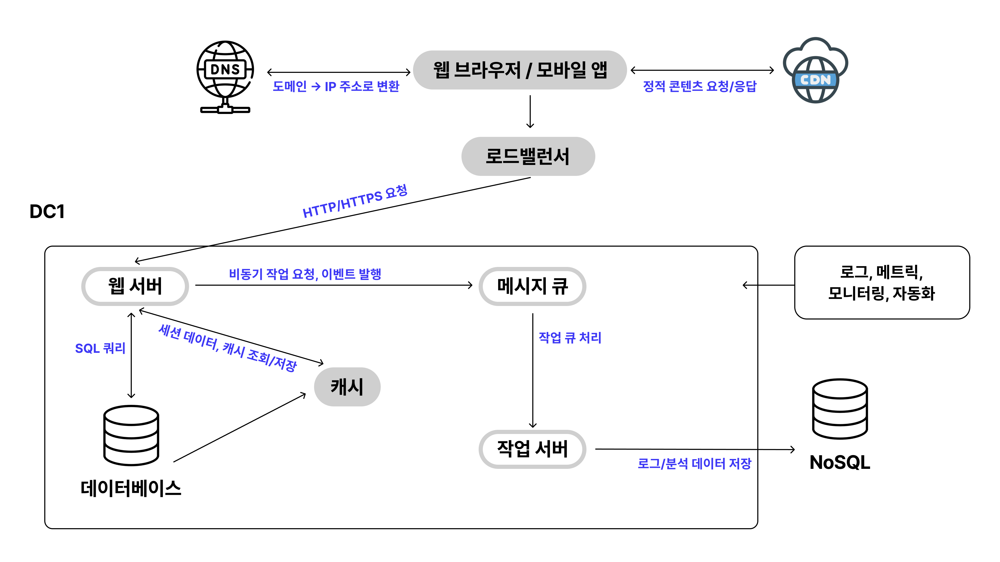

# 1장

### 1. 사용자의 요청 처리

- 흐름
    1. 사용자가 웹/모바일 앱에서 `https://acc.com` 입력

   
   
     - **이미 방문한 적이 있다면?**
         1. PC OS 자체의 DNS 캐시 확인
         2. 브라우저, 라우터 캐시, ISP DNS 서버의 캐시 확인
        
         → 캐시에 있으면 바로 IP 반환

   

    - **처음 방문한다면?**
        1. PC → 라우터 → ISP DNS 서버로 재귀적 질의
            1. ISP DNS 서버의 질의 과정
                1. 루트 DNS 서버에 질의 → TLD 서버(.com, .net 등) 주소 반환
                2. TLD 서버에 질의 → 해당 도메인의 권한 있는 DNS 서버 주소 반환
                3. 권한 있는 DNS 서버에 질의 → 실제 IP 주소(A 레코드) 반환

                 

    → 결국 이 과정을 통해서 웹 서버의 IP 주소를 반환 받게 되고, HTTP 요청을 보낼 수 있게 되는 것
    
    → 웹 서버는 요청에 대한 응답을 HTML, JSON으로 반환

 

### 2. 데이터베이스
 : 보통 데이터베이스 전용 서버를 분리

- 어떤 데이터베이스를 사용할 것인가?
    - **관계형 데이터베이스 RDBMS**
        - 우리가 흔히 사용하는 DB
        - MySQL, 오라클, PostgreSQL
    - **비관계형 데이터베이스 NoSQL**
        - 사용 목적, 조회 패턴, 데이터 형태에 따라 구조가 달라짐
        - 저장 방식에 따라 나눌 수 있음
      
           
      
    |  | 저장 방식 | 예시 | 특징 |
    | --- | --- | --- | --- |
    | 키값 저장소 | {key, value} 로 저장 | redis, DynamoDB | 캐시, 세션 관리 시에 사용. 빠르다! |
    | 문서 저장소 | json, xml 같은 문서 단위로 저장 | mongoDB, couchDB | 데이터 구조가 복잡할 때 사용. 스키마가 유연하다.  |
    | 칼럼 저장소  | 열 단위로 저장 | HBase, Cassandra | 특정 컬럼 단위로 조회하는 경우가 잦은 경우 사용. |
    | 그래프 저장소 | 노드와 엣지로 저장 | JenusGraph | 데이터 관계가 중요한 경우 사용. (친구 추천, SNS) |

 

### 3. 서버 규모 확장 

- Scale Up **수직적 규모 확장** → 서버 자원 늘리기
    - 확장에 한계가 있음
    - 장애에 대한 복구, 다중화 문제
- Scale Out **수평적 규모 확장** → 서버 개수 늘리기

    ⇒ 이걸 위해서 **로드밸런서**를 도입

 

### 4. 로드밸런서

: 트래픽 부하를 고르게 분산하는 역할

- 그래서 뭘 하는지?
    - 트래픽 분산
    - 장애 감지 Failover
    - 세션 유지
    - 확장성 지원

     

- 흐름
    1. 보통 DNS에서 반환 받은 IP 주소가 로드밸런서의 IP 주소 (서버 간 통신에는 사설 IP 주소를 사용하기 때문)
    2. 로드 밸런서에서 들어온 요청들을 대상그룹으로 고르게 분산해서 전달
  
     
  - 그럼 어떻게 고르게 분산할까?
   
  
  |  | 분산 방식                   | 장점                                          |
  | --- |-------------------------|---------------------------------------------|
  | 라운드로빈 | 순서대로                    | 간단함                                         |
  | IP 해시 | Client IP를 해시 함수에 넣어서   | 세션을 유지할 수 있음. 동일한 클라이언트 IP는 동일한 서버로 요청이 들어감 |
  | 가중치 기반 | 비율 지정 A:B:C = 5:3:2로 배분 | 서버의 성능과 스펙이 다른 경우 사용하기 좋음                   |

 

### 5. 데이터베이스 다중화

: 데이터베이스 서버를 여러 대 두고, 주 서버에서 쓰기 연산을 지원하고 부 서버는 읽기 연산만 지원하는 방식을 많이 사용 
→ 성능, 안정성, 가용성 ↑

**Q. MySQL에서의 다중화 vs AuroraDB에서의 다중화??**

- 일반 RDS : 인스턴스마다 개별 스토리지를 사용하기 때문에 주 서버에서 트랜잭션을 처리하고 로그를 보내면 부 서버가 적용하는 방식. → **비동기**
- 오로라 : 모든 인스턴스가 공유 스토리지 레이어에 직접 접근하기 때문에 주 서버와 부 서버가 동일한 스토리지를 읽으므로 별도의 복제 과정이 없는 방식. → **거의 동기**

- 만약 데이터베이스 서버 중 하나가 다운된다면?
    - 부 서버가 다운된 경우 → 다른 서버가 이를 대체하고, 새로 생성
    - 주 서버가 다운된 경우 → 부 서버가 주 서버가 되고, 새로 생성

    
**정리**

    1. 사용자는 DNS로부터 로드밸런서의 IP 주소를 받아서
    2. HTTP 요청을 보내고
    3. 로드밸런서는 요청을 받아서 분산 방식에 따라 특정 서버로 요청을 보냄
    4. 웹 서버는 사용자의 데이터를 부 서버에서 읽어오고
    5. 새로운 내용을 주 서버에 전달해서 저장함

 

### 6. 캐시

: 응답 시간을 단축하기 위해 사용

→ 자주 조회되지만 바뀌지 않는 데이터를 캐시에 두는 것이 바람직. 영속성 데이터는 X.

- 캐시 종류

    |  | 역할 | 왜 쓰는지 |
    | --- | --- | --- |
    | 브라우저 캐시 | 클라이언트에서 정적 파일을 저장 | 사용자 단에서 빠르게 정적 파일을 받아오기 위해 사용 |
    | 프록시(CDN) 캐시 | cloudflare, cloudfront 같은 CDN이 정적 파일을 캐싱 | **지리적 거리 단축**으로 전송 지연 최소화, 원 서버 부하 감소를 위해 사용 |
    | 서버 캐시 | 자주 요청되는 결과를 인메모리에 저장 | 응답 속도를 개선하고 서버 부하를 완화하기 위해 사용 |

- 캐시 서버 vs 웹 서버?

    | 구분 | 웹 서버 | 캐시 서버 |
    | --- | --- | --- |
    | 역할 | 요청 처리, 응답 반환 | 자주 쓰이는 데이터 임시 저장 |
    | 주요 기능 | HTML/JSON 반환, DB/API 호출 | Key-Value 저장, TTL, LRU 관리 |
    | 위치 | 클라이언트 ↔ 웹 서버 ↔ DB | 웹 서버와 DB 사이, 또는 클라이언트 가까이(CDN 등) |
    | 저장 방식 | 디스크 기반, 필요 시 메모리 활용 | 메모리 기반 (속도 최적화) |

 

- 캐시 계층
    : 데이터가 TTL만큼 잠시 보관되는 곳
    
        - TTL (Time To Live)
        - 캐시에 데이터가 들어올 때 값을 설정
        - 시간이 지나면 캐시가 자동 만료됨
            
            +) 보통 어느 정도로 설정하는 것이 권장되는지?
                - 세션 정보 : 30분~2시간
                - 자주 바뀌는 API 응답 : 10초~60초
                - 거의 바뀌지 않는 참조 데이터 : 1시간~24시간
                - 인기 상품/게시글 : 5분~15분

  - 캐시 만료/삭제 전략
      - **고정 TTL**
          - 캐시할 때 유효 기간을 설정
      - **LRU(Least Recently Used) 기반**
          - TTL과 관계없이, 메모리가 꽉 찼을 때 오래 안 쓰인 데이터부터 삭제
          - TTL은 만료 기준, LRU는 캐시 공간 확보 기준이라는 점에서 다름
          - 웹 브라우저, 세션 캐시 (짧고 변동이 큰 요청)
      - **LFU(Least Frequently Used) 기반**
          - TTL과 관계없이, 메모리가 꽉 찼을 때 ****빈도가 가장 낮은 데이터부터 삭제
          - DB 쿼리 캐시, 인기글 조회 (장기간 반복되는 요청)
      - **FIFO 기반** (가장 먼저 들어온 데이터부터 삭제)
      - **수동 삭제**
          - 데이터가 갱신될 때 캐시를 직접 지움
          - 주요 방식:
              - **Write-through**
                  - DB에 쓰기와 동시에 캐시에도 반영
              - **Write-around**
                  - DB에만 쓰고, 캐시는 안 건드림 → 다음 조회 시 캐시에 적재
              - **Write-back (Write-behind)**
                  - 캐시에 먼저 쓰고, 나중에 비동기로 DB에 반영

   

- **캐시 계층의 규모를 확장시키려면?**
    - 클라이언트 측 샤딩
        - 클라이언트가 키 해싱을 이용해 여러 캐시 서버 중 어디에 넣을지 결정
        - 단점: 캐시 서버 수가 변하면 해시 재계산 필요 → 일관성 해으로 개선 가능
    - 캐시 미들웨어/프록시 사용 
        - 클라이언트가 직접 샤딩을 신경 쓰지 않고, 캐시 프록시가 요청을 적절히 라우팅
    - 분산 캐시 시스템
        - 자체적으로 분산과 샤딩을 관리하는 캐시 클러스터 사용
        - 스케일 아웃으로 노드를 추가해도 자동 분산 처리

- **캐시 서버 간 데이터 불일치 문제**
    - 원인 : TTL 만료 시간 차이, 지역별 캐시 서버 업데이트 지연, 정책 차이
        
        ⇒ 짧은 TTL 설정, write-through 적용, 한 지역에서 업데이트 시 메시지 브로커(Pub/Sub)로 다른 지역 캐시에 알림 전송, 지역별로 독립 캐시를 두고 최종 일관성 챙기기 등의 방법으로 해결
        

- 캐시 메모리가 너무 작으면 성능 떨어짐
    - 보통 세션 캐시의 경우 `사용자 수 * 세션 크기 * 1.2~1.5` 정도로 둔다고 함!
- 캐시 메모리를 과할당
    - LRU 정책으로 인해 데이터가 빨리 날아가는 것을 방지할 수 있음
    - hit rate 최적화를 위해 약간 과할당 하는 것이 일반적임

 

### 7. 콘텐츠 전송 네트워크 (CDN)
: 정적 파일과 일부 동적 콘텐츠를 캐싱

- **콘텐츠 무효화**
    - 아직 만료되지 않은 콘텐츠를 캐시에서 제거하기 위함
        - CDN 서비스 사업자가 제공하는 API를 이용해서 제거 가능
        - 오브젝트 버저닝을 사용하면 다른 버전을 서비스하도록 할 수 있음
            - v=2에서 버전 숫자는 개발자가 관리해야 함. 
            관리 방법: 수동 설정, 빌드/배포 시 자동 생성, 파일 해시 기반 생성 등
            - CDN은 URL이 다르면 다른 객체로 인식하기 때문에 캐시 충돌 없음
    - 보통 HTML은 캐시 무효화를 통해 갱신, 정적 파일은 파일 해시 기반 버저닝을 통해 갱신

 

### 8. 무상태 웹 계층

- 상태 정보 의존적인 아키텍처
    - 클라이언트 관련 상태(세션, 데이터, 캐시)가 특정한 서버에만 저장되기 때문에
    요청이 반드시 한 서버에서만 이어져야 함 
        
        → 이래서 로드밸런서에서 세션 스티키를 설정하지만 서버 추가, 장애 처리가 복잡해짐
  
            
            - 고정 세션 (Sticky Session)
                - 특정 사용자의 요청을 항상 같은 서버로 보내주는 기능
                - 쿠키 기반 or IP 해시 기반

 

- 무상태 아키텍처

- **캐시 서버와 CDN의 차이?**
    - 둘 다 캐싱을 하지만, 위치와 목적이 다름
    - CDN은 지리적으로 가까운 서버에서 응답하기 위해 사용
    캐시 서버는 DB 부하를 줄이고 성능을 향상시키기 위해 사용

 

### 9. 지리적 라우팅

: 사용자의 위치에 따라 가까운 데이터 센터로 안내

**IP 기반**
    
    : IP로 물리적 위치를 확인하고 GeoIP로 매핑
    
    - 대부분 IP 기반
    - 모바일, VPN, NAT 환경은 위치 정확도 떨어짐

**GPS 기반**
    
    : 클라이언트가 GPS 좌표를 가져와서 요청에 포함
    
    - 주로 위치 기반 서비스에서 자주 사용
    - 배달 앱, 지도 서비스, 위치 기반 알림

**Anycast 기반**

    - 동일한 IP 주소를 여러 데이터 센터에 할당하고, 가장 가까운 네트워크 경로로 트래픽을 라우팅
    - CDN, DNS 서버
    
    (+) AWS에서의 Anycast 활용 예시
        → Route 53 : Anycast를 통해 사용자와 가장 가까운 엣지 로케이션으로 DNS 요청 라우팅
            (* Route 53에서 Geolocation Routing을 설정하면 IP 기반으로 특정 리전으로 라우팅 가능)
        
        → CloudFront (CDN) : 사용자가 가까운 엣지 서버에서 콘텐츠를 빠르게 전달받도록 함
        
        → Global Accelerator : Anycast IP를 제공하여 여러 리전의 애플리케이션 엔드포인트에 자동으로 가장 빠른 경로로 트래픽 라우팅

 

### 10. 그 외

- 메시지 큐
    
    : 분산 시스템 환경에서 서비스 간 데이터를 안전하게 비동기적으로 전달
    
    → RabbitMQ, Kafka, AWS SQS, Redis Streams
    

    - 생산자와 소비자 서비스의 규모를 독립적으로 확장 가능
    - 한쪽 서비스가 다운되어도 메시지 발행/수신 가능

- 로그 관리 : Grafana, Cloudwatch, Azure monitor
- 메트릭 수집 : Prometheus
- 자동화 : GitHub Actions

 

### 11. 데이터베이스의 규모 확장

- 수직적 확장 → SPOF (Single Point of Failure)로 인한 위험
- 수평적 확장 == 샤딩 sharding
    - 데이터베이스를 샤드(shard)라고 부르는 작은 단위로 분할하는 것
    - 샤딩 키를 통해 데이터를 여러 개의 샤드에 나누어서 저장.
        - 이 때 샤딩 키는 균등하게 분배되도록 쿼리 패턴을 고려해서 잘 변경되지 않는 값으로

- **샤딩 시 발생하는 문제**
    1. 데이터의 재샤딩 : 샤드에 데이터가 너무 많아졌을 때 샤드 소진이 발생하면 샤드 키 계산 함수를 변경하고 데이터를 재배치
    2. 유명인사(핫스팟 키) 문제 : 특정 샤드에만 질의가 집중되면 과부하가 올 수 있음
    3. 조인과 비정규화 : 여러 샤드에 걸친 데이터를 조인하기 힘듦