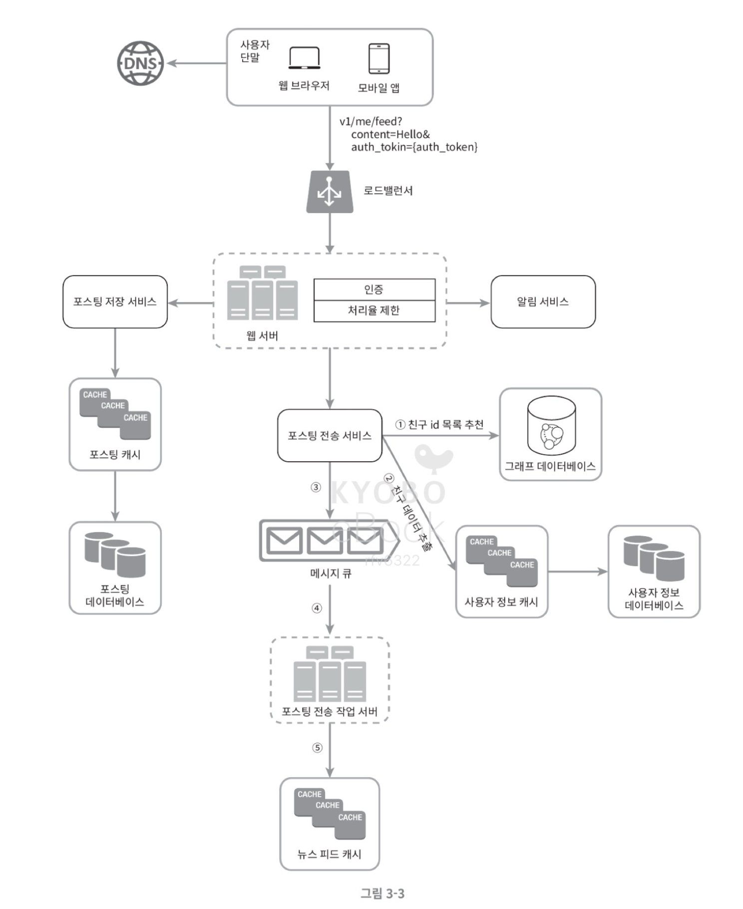

## 2장. 개략적인 규모 추정

❓**개략적인 규모 추정** : 시스템을 설계할 때 필요한 리소스를 대략적으로 계산해보는 것.

- 왜 하는지?
    1. 설계 방향성 확인
    2. 병목 지점 파악
    3. 현실성 검증
    4. 비용 고려

✔️ **병목 지점 (bottleneck)** : 시스템의 전체 성능을 제한하는 지점

| 자원  | 병목이 발생하는 경우  |
| --- | --- | 
| 네트워크 대역폭 | 요청, 응답이 많아져서 네트워크 속도가 한계에 도달 | 
| DB 읽기/쓰기 처리량 | 초당 트랜잭션 수가 DB 한계를 초과하는 경우 | 
| 스토리지 용량/IOPS | 로그, 미디어 저장이 너무 많아서 디스크 입출력이 따라가지 못하는 경우 | 
| CPU/메모리 | 애플리케이션 서버가 너무 많은 연산을 처리하느라 CPU, RAM이 다 찬 경우 | 
| 락 경쟁 | 여러 요청이 서로 동시에 자원,DB를 잡으려다 데드락이 걸리는 경우  |

- **병목 지점은 어떻게 찾고 어떻게 해결해야 할까?**

| 자원              | 어떨 때 (병목 상황)               | 어떤 전략 (해결 방법)                          |
| --------------- | -------------------------- | -------------------------------------- |
| **네트워크**        | 트래픽 폭증 시 서버 대역폭 초과         | CDN 사용, 로드 밸런서로 트래픽 분산                 |
|                 | 특정 지역에서 응답 지연              | 멀티 리전 배포, Anycast 라우팅                  |
|                 | 정적 콘텐츠(이미지, 영상)가 직접 서버로 몰림 | CDN 캐싱, 이미지/동영상 최적화, 압축 전송             |
| **애플리케이션 서버**   | CPU/메모리 사용률 급증, 요청 처리 불가   | 수평 확장(오토스케일링), 마이크로서비스 분리              |
|                 | 동시 요청 수 초과로 스레드 부족         | 비동기 처리, 메시지 큐(Kafka, SQS 등)            |
|                 | 특정 서비스 장애가 전체에 전파          | 서킷 브레이커, Rate Limiting                 |
| **데이터베이스**      | 초당 TPS(읽기/쓰기) 한계 도달        | 읽기 리플리카 추가, 샤딩, 파티셔닝                   |
|                 | 특정 테이블에 핫스팟 발생             | 데이터 모델링 변경, Sharded Counter            |
|                 | 복잡한 조회로 응답 지연              | 인덱스 최적화, CQRS 패턴                       |
|                 | 단일 노드 장애로 서비스 중단           | Master-Slave 구조, Multi-AZ 배포           |
| **스토리지**        | 이미지/영상 업로드 폭증              | 객체 스토리지(AWS S3 등) 사용, CDN 캐싱           |
|                 | 로그 데이터 폭증 → 디스크 용량 부족      | 로그 스트리밍 파이프라인(Kafka → S3/ES)           |
|                 | 자주 쓰는/안 쓰는 데이터 혼재          | 핫/콜드 스토리지 분리 (SSD vs HDD/Glacier)      |
|                 | 대용량 파일 업로드 지연              | Chunk Upload(조각 단위 업로드)                |
| **락 / 트랜잭션 충돌** | 동시에 같은 데이터(재고, 좋아요 수 등) 갱신 | Optimistic Lock, Pessimistic Lock      |
|                 | 단일 카운터(조회수, 좋아요 수)에 집중     | 분산 카운터(Redis INCR, Sharded Counter)    |
|                 | 즉시 일관성이 꼭 필요하지 않음          | Eventual Consistency 허용, CQRS + 이벤트 소싱 |
|                 | Deadlock 발생                | 트랜잭션 범위 최소화, 락 순서 일관되게 유지              |

 

---

### 1. 2의 제곱수

- 최소 단위 = 1바이트 = 8비트

| 2의 x제곱 | 근사치 | 이름 | 축약형 |
| --- | --- | --- | --- |
| 10 | 1천 | 1킬로바이트 | 1KB |
| 20 | 1백만 | 1메가바이트 | 1MB |
| 30 | 10억 | 1기가바이트 | 1GB |
| 40 | 1조 | 1테라바이트 | 1TB |
| 50 | 1000조 | 1페타바이트 | 1PB |

 

### 2. 응답지연 값 (Latency)

: 요청 -> 처리 -> 응답까지 소요되는 시간 (ms)

    - Latency vs Throughput
        - Latency는 한 요청을 처리하는 데 걸린 시간 (개별 요청 체감 속도)
        - Throughput는 초당 몇 개의 요청을 처리할 수 있는지 (시스템 전체 성능)

- **Latency 구성 요소**
    1. 네트워크 지연 (클라이언트-서버의 물리적 거리)
    2. 전송 지연 (패킷 크기, 네트워크 대역폭 지연)
    3. 큐잉 지연 (요청이 라우터, 서버 큐에서 대기)
    4. 처리 지연 (서버가 요청 처리하는 도중 지연)
    5. 디스크 I/O 지연

 

- 보통 평균 지연 시간 p95, p99 Latency를 줄이는 것이 핵심
  -> **어떻게?**
    - CDN 사용, 멀티리전 배포
    - 캐싱, 비동기처리, 최적화
    - 인덱스 최적화, 샤딩, 레플리카
    - SSP, 객체스토리지
    - 오토스케일링, 메시지큐 병렬 소비

---

### ✅ 결론

    - 메모리는 빠르지만 디스크는 느리다
    - 디스크 탐색은 가능한 한 피하라 
    - 단순한 압축 알고리즘은 빠르다
    - 데이터를 인터넷으로 전송하기 전에 가능하면 압축하라
    - 데이터 센터는 보통 여러 지역에 분산되어 있고, 센터들 간에 데이터를 주고받는 데는 시간이 걸린다. 

**🧐그런데, 왜??**

1. 메모리가 정말 더 빠른가?

   | 저장소               | 접근 속도 (대략)    |
   | ------------------ | ----------------- | 
   | CPU 캐시 | 수 ns (10⁻⁹초) | 
   | RAM (메모리)      | 100 ns | 
   | SSD (디스크)      | 0.1 ms | 
   | HDD (자기 디스크)   | 5~10 ms | 
   | 네트워크 (1 hop)   | 0.5~1ms  |

3. **디스크 탐색은 왜 피해야 할까?**

- 랜덤 접근이 특히 느림
- 디스크 I/O는 병목 가능성이 높고 전체 Latency의 가장 큰 원인인 경우가 많음
- 메모리는 전자적으로 직접 접근이 가능
    - CPU가 RAM에 직접 접근 가능

3. **데이터를 압축하면 더 좋은가?**

- 네트워크 병목은 보통 전송할 데이터의 크기에 비례함
    - 100MB를 100Mbs로 전송하면 8초가 걸린다고 할 때, 20MB로 압축하면 1.6초 걸림
- 압축하는 데에 드는 CPU 비용보다 네트워크 전송 절약 효과가 더 큼
    - CPU는 초당 수 GB를 처리하는 반면, 네트워크는 수십~수백 Mbs를 전송할 수 있음
- 그러나 초저지연 서비스인 경우는 X
- 애초에 이미 압축되어 있는 jpeg, mp4, zip가 아니라, 로그 파일이나 json 응답을 압축하는 것이 효율적

4. **데이터 센터가 분산되어 있는 이유?**

- 전 세계에 분산되어 있는 이유? : 지연 최소화, 장애 복구, 규제, 법적 요건, 트래픽 분산
- 데이터 센터끼리 데이터를 주고 받는 이유? : 데이터 복제/백업, 콘텐츠 전송, 멀티 리전 아키텍처, 데이터 분석, AI 학습
- 얼마나 걸릴까?
    - 같은 리전의 AZ 간 : 1~2ms
    - 같은 대륙 내 리전 간 : 수십 ms
        - 서울 - 도쿄 30ms
        - 서울 - 싱가포르 70ms
    - 대륙 간 : 수백 ms
        - 서울 - 미국 동부 150~200ms

 

### 3. 가용성과 관계된 수치들

- 고가용성 : 시스템이 오랜 시간 동안 지속적으로 중단 없이 운영될 수 있는 능력

- **SLA (Service Level Agreement)**
    - 서비스 사업자와 고객 사이에 맺어진 합의
    - 주로 가용성, 응답 시간, 처리량, 지원 체계에 대한 내용을 다룸

| 가용률      | 하루당 장애시간 | 개월당 장애시간 | 연간 장애시간 | 사용되는 곳             |
|----------|----------|---------|--------|--------------------|
| 99%      | 14.40분   | 7.31시간  | 3.65일  | 보통의 스타트업, 사내 내부 시스템 |
| 99.9%    | 1.440분   | 43.83분  | 8.77시간 | 대규모 웹 서비스          |
| 99.99%   | 8.64초    | 4.38분   | 52.60분 | 금융, 결제, 의료 서비스     |
| 99.999%  | 864.00밀리초 | 26.30초  | 5.26분  | 통신망, 항공관제, 군사 시스템  |
| 99.9999% | 86.40밀리초 | 2.63초   | 31.56초 |                    |

-> 목표치를 늘릴수록 비용도 급격하게 상승하므로... 정말 필요한 만큼 늘리는 것이 좋다

### 4. 트위터 QPS와 저장소 요구량 추정

1. 가정
- 월간 능동 사용자는 3억명
- 50%의 사용자가 매일 트위터를 사용
- 평균적으로 2건의 트윗
- 미디어를 포함하는 트윗은 10% 정도
- 데이터는 5년간 보관

2. 추정
- QPS = 3억명 * 0.5 * 2트윗 / 24시간 / 3600초 = 3500, 최대 QPS는 *2 해서 7000
    - 저장소 요구량 = 3억명 * 0.5 * 2트윗 * 10% * 1MB * 5년 = 55PB

✨ **풀이 팁**
- 계산을 할 때에는 근사치를 활용하자
- 가정은 적어두자
- 단위를 붙이자

 

**(+) 풀어봅시다!**
- 사진 기록 앱을 설계하려고 합니다.
- 하루에 50만명이 서비스를 이용하고, 각 사용자가 하루에 평균 4장의 사진을 업로드한다고 가정합니다. 한 장의 사진 평균 용량은 2MB입니다.
- 하루 업로드 데이터 용량은 얼마일까요?
- 월별 스토리지 용량을 대략 얼마로 잡아야 할까요?

 

--- 

## 3장 시스템 설계 면접 공략법

- 시스템 설계 면접은 기술적 측면만 평가하는 것이 아님
- 지원자가 협력에 적합한 사람인지, 압박이 심한 상황도 잘 헤쳐 나갈 수 있는지, 모호한 문제를 건설적으로 해결할 능력이 있는지, 좋은 질문을 던질 능력이 있는지를 봄
- 설계의 순수성도 좋지만 타협적 결정을 할 줄 알아야 함

- **효과적 면접을 위한 4단계 접근법**
    1. 문제 이해 및 설게 범위 확정
        - 천천히 생각해도 됨. 요구사항을 정확하게 이해하고 모호함을 없애야 함
        - 올바른 질문을 하고 적절한 가정을 하는 것이 중요
        - 구체적으로 필요한 기능들이 뭔지? 사용자 수는 어느 정도인지? 회사의 규모는 앞으로 얼마나 커질 예정인지?
    2. 개략적인 설계안 제시 및 동의 구하기
        - 청사진을 제시하고 의견을 구할 것
        - 핵심 컴포넌트를 포함하는 다이어그램을 그린 뒤, 해당 설계안이 제약사항을 만족하는지 개략적으로 계산해보기
    3. 상세 설계
        - 달성해야 하는 목표와 기능 범위를 확인하고 개략적 청사진 완성
        - 설계안에 대한 면접관의 의견을 묻고 수정
        - 시스템의 병목 구간이나 자원 요구량 추정치에 대해 질문할 수도 있음
    4. 마무리
        - 개선 가능한 지점, 병목 구간 또는 장애가 발생할 경우에 대한 질문이 올 수 있음.

    - 요구사항이나 가정을 명확히 한 상태에서 설계를 제시하자.
    - 내 설계는 완벽하지 않다. 개선할 점을 찾아내보자.
    - 너무 사소한 부분에서 시간을 낭비하지 마라.
    - 소통을 주저하지 말고, 막혔다면 면접관에게 힌트를 청하거나 아이디어를 이끌어내보자. 면접관을 팀원처럼 대하라.
    - 시간 배분은 1단계 3~10분, 2단계 10~15분, 3단계 10~25분, 4단계 3~5분 정도로 사용하는 것을 권장하지만 때에 따라 달라질 수 있다. 언제나 면접관의 요구사항에 집중하자.

 

---

### 🧐 '예제) 뉴스피드 시스템을 설계하라'에서 추가적으로 받을 수 있는 질문에는 무엇이 있을까?

| 핵심 질문                                                      | 면접관 의도 (왜 물어보는가)                                       | 답변 예시                                                                                                                                                                                                                     | 사용된 개념                                                                      |
| ---------------------------------------------------------- | ------------------------------------------------------ | ------------------------------------------------------------------------------------------------------------------------------------------------------------------------------------------------------------------------- | --------------------------------------------------------------------------- |
| **1. 뉴스피드 캐시에 업데이트가 실패했을 때 데이터 정합성을 어떻게 보장하나요?**           | 캐시와 DB 사이의 **불일치 상황 처리 능력** 확인                         | “캐시 쓰기에 실패하면 DB를 기준으로 삼고, TTL을 짧게 설정해 eventual consistency를 유지합니다. 메시지 큐로 캐시 업데이트를 재시도하는 방식도 사용합니다.”                                                                                                                      | **eventual consistency**, **fallback 전략**, **캐시 무효화 정책**                    |
| **2. 메시지 큐를 어떤 기준으로 선택했는지? (Kafka vs RabbitMQ vs SQS)**    | 단순히 큐를 그렸다고 끝이 아니라, **메시지 시스템의 특성과 서비스 요구사항 매칭 능력** 확인 | “Kafka는 대규모 스트리밍 처리와 높은 처리량에 적합하고, RabbitMQ는 라우팅·우선순위 큐 같은 복잡한 메시징에 강합니다. SQS는 완전 관리형이라 운영 부담이 적습니다. 저희 서비스는 뉴스피드 전송량이 많아 **Kafka**가 더 적합합니다.”                                                                            | **Kafka(고처리량, 로그 기반)**, **RabbitMQ(라우팅, 보장된 전달)**, **SQS(서버리스, 관리형)**       |
| **3. 메시지 큐 장애나 중복 전송 문제를 어떻게 처리할 건가요?**                    | **신뢰성 있는 비동기 처리**를 할 수 있는지 확인                          | “메시지 처리 실패 시 retry 메커니즘을 두고, 여러 번 실패하면 DLQ(Dead Letter Queue)로 보내 후처리합니다. 또한 idempotency 키를 사용해 중복 전송 시에도 최종 결과는 한 번만 반영되도록 합니다.”                                                                                         | **retry 메커니즘**, **DLQ**, **idempotency(멱등성)**                               |
| **4. 사용자 수십만 명 규모일 때 병목이 어디서 생길 것 같나요? (DB, 큐, 캐시, 네트워크)** | **성능 병목 지점 파악 능력**을 확인                                 | “대규모 환경에서는 DB 쓰기/읽기 부하가 가장 큰 병목이 될 수 있습니다. 메시지 큐는 소비 속도보다 생산 속도가 빠르면 적체가 생기고, 캐시는 무효화 시점에 트래픽이 DB로 몰릴 수 있습니다. 네트워크는 데이터 전송량이 크면 지연이 발생합니다. 따라서 모니터링 지표를 통해 병목을 수시로 파악하고, DB는 샤딩·리플리카, 큐는 파티셔닝, 캐시는 pre-warm 전략 등을 적용합니다.” | **TPS(초당 트랜잭션 수)**, **큐 백프레셔(backpressure)**, **캐시 stampede**, **네트워크 대역폭 한계** |
| **5. 인증 서버가 병목이 될 수 있는데, 어떻게 확장하시겠습니까?**                   | **보안 + 확장성** 동시에 고려하는지 평가                              | “JWT 같은 self-contained 토큰을 사용하면 웹 서버가 자체 검증할 수 있어 인증 서버로의 요청이 줄어듭니다. 인증 서버는 토큰 발급만 담당하게 하여 병목을 피합니다. 필요하면 Redis 같은 중앙 세션 저장소를 활용합니다.”                                                                                     | **JWT 인증**, **stateless 서버**, **세션 중앙화(Redis)**                             |

---

- **eventual consistency (최종 일관성)** :
  지금 당장은 데이터가 달라 보일 수 있지만, 시간이 지나면 결국 동일한 값으로 맞춰지는 일관성 모델.

- **fallback 전략** :
  메인 시스템이 실패하면 대체 경로나 방법을 사용해 서비스를 이어가는 방식.

- **캐시 무효화 정책** :
  캐시에 저장된 오래된 데이터를 언제·어떻게 삭제하거나 갱신할지 정하는 규칙.

- **Kafka (고처리량, 로그 기반)** :
  대규모 데이터를 빠르게 전송·처리하는 데 강한 스트리밍 플랫폼.

- **RabbitMQ (라우팅, 보장된 전달)** :
  메시지를 다양한 규칙에 따라 전달할 수 있고, 확실하게 한 번 전달하는 데 강점이 있는 메시지 브로커.

- **SQS (서버리스, 관리형)** :
  AWS에서 제공하는 메시지 큐 서비스로, 운영을 직접 하지 않아도 되고 서버 관리가 필요 없음.

- **retry 메커니즘** :
  메시지 처리 실패 시 자동으로 다시 시도하는 기능.

- **DLQ (Dead Letter Queue)** :
  여러 번 실패한 메시지를 따로 모아두는 보관용 큐.

- **idempotency (멱등성)** :
  같은 작업을 여러 번 해도 최종 결과가 한 번 실행한 것과 똑같이 유지되는 성질.

- **TPS (초당 트랜잭션 수)** :
  시스템이 1초에 처리할 수 있는 작업(요청)의 개수를 나타내는 지표.

- **큐 백프레셔 (backpressure)** :
  메시지가 쌓이는데 소비 속도가 따라가지 못해 큐가 밀리는 현상.

- **캐시 stampede** :
  캐시가 한 번에 만료되면서 많은 요청이 동시에 DB로 몰리는 문제.

- **네트워크 대역폭 한계** :
  네트워크가 동시에 처리할 수 있는 데이터 양이 정해져 있어, 이를 넘으면 지연이 발생하는 상황.

- **JWT 인증** :
  사용자 정보를 담은 토큰을 주고받아 서버가 별도 저장 없이도 인증을 확인할 수 있는 방식.

- **stateless 서버** :
  서버가 클라이언트 상태를 직접 저장하지 않고 요청마다 독립적으로 처리하는 구조.

- **세션 중앙화 (Redis)** :
  여러 서버가 같은 세션 정보를 공유할 수 있도록, 외부 저장소(예: Redis)에 세션을 모아 관리하는 방식.

---
