## 4장. 처리율 제한 장치의 설계

### 처리율 제한 장치
-> 클라이언트 또는 서비스가 보내는 트래픽의 처리율을 제어하기 위한 장치  

- 예시
  - 사용자는 초당 2회 이상 새 글을 올릴 수 없다.  
  - 같은 IP 주소로는 하루에 10개 이상의 계정을 생성할 수 없다.  
  - 같은 디바이스로는 하루에 한 번만 투표할 수 있다.  

- 처리율 제한 장치는 Dos 공격에 의한 자원 고갈을 방지할 수 있다.
  > 여기서 **Dos 공격**이란?  
  > : 정상 사용자가 서비스를 이용하지 못하도록 의도적으로 자원을 고갈시키는 것
  > 1. 트래픽 폭주형 (다수의 요청/패킷을 보내서 공격)
  > 2. 자원 집중형 (비중이 큰 연산 반복 요청으로 서버 부하 증가)
  > 3. 취약점 악용형 (특정 버그, 병목 자원을 노려서 서버를 마비시킴)
  > 

  > **DDos**는 다수의 분산된 PC로 공격하는 것으로, 방어하기 더 어려움.  
  > 추가 보안 장치가 필요 : WAF, CDN 기반의 Anti-DDos, CAPTCHA, 트래픽 스크러빙 서비스

- 처리율 제한 장치는 비용을 절감한다.  
  - 우선순위가 높은 API에 더 많은 자원 할당 가능
  - API에 대한 횟수를 제한해서 과금을 막을 수 있음

- 서버 과부하를 막는다. 
  - 봇에서 오는 트래칙이나 잘못된 이용 패턴으로 유발된 트래픽을 걸러낼 수 있음

> **처리율 제한 장치는 클라이언트 측과 서버 측 중에서 어디에 두는 것이 좋은지? 그 차이는?**  
> 1. 클라이언트 측 제한
>    - 코드 내부에서 조절, SDK 내장 rate limiter 사용
>    - 사실상 보안 측면에서는 무력. 자원 절약 용도로 사용
> 2. **서버 측 제한 (권장)**
>    - 애플리케이션 레벨에서 제한하는 경우 스프링부트의 필터, 인터셉터 등으로 구현
>    - 인프라 레벨에서 제한하는 경우 Nginx, API gateway, Envoy에서 설정
>    - 클라우드 서비스를 이용하는 경우 자동 제공하는 rate limiting을 사용
> 
> **직접 구현해야 하는지? 서비스가 있는지?**   
> : 개발자가 직접 구현할 수도 있고 자동 제공 서비스를 사용할 수도 있음.  
> - 직접 구현할 경우
>   - 오픈소스 라이브러리 사용: Bucket4j(Java), resilience4j, ratelimit.js(Node.js)
>   - Redis/Lua 스크립트 기반 rate limiter 직접 작성  
>   - Nginx limit_req_zone 같은 설정 수동 적용  
> - 자동 제공 서비스  
>   - AWS API Gateway → usage plan으로 초당 요청 수 제한  
>   - Cloudflare → DDoS 방어 + rate limiting rules 제공  
>   - Kong API Gateway, Envoy → 플러그인/필터로 제공  
>   - GCP Cloud Endpoints → Quotas 기능

> **API 호출을 제한하는 기준은?**  
> : 보통 IP 주소 단위, 계정 단위, 기기/브라우저 단위, 엔드포인트 단위, 멀티 키 단위로 제한  
> 
> ! 기기/브라우저 단위로 제한하는 경우 기기 정보 위조 가능  
>  -> user-agent 변경, 세션 초기화, selenium, puppeteer로 브라우저 자동화, IP/네트워크 우회, mac 주소 스푸핑, 에뮬레이터 사용 등의 방법으로

> 티켓팅 사이트의 새로고침 반복, 매크로 요청은 처리율 제한 장치를 이용해서 방지  
> Nginx, Redis rate limiter, WAF 등에서 적용 가능함  
> 
> Quota, Unique Constraint 와는 다름!  
>  : 기기 식별 값을 저장해서 중복 호출 방지를 구현한 것
> 
> Rate Limiting은 시간 단위로 몇 회까지 가능하게 하는 것이고, Quota, Unique Constraint는 특정 조건에서 몇 회까지 가능한지 제한하는 것

---

### 1. 처리율 제한 장치는 어디에 둘 것인가? 

**클라이언트 측**에 두는 것은 쉽게 위변조가 가능하고 통제하는 것이 어려워 권장되지 않음.  
**서버 측**에 두는 경우 두 가지 위치에 둘 수 있음.  

-> 서버에서 직접 제한
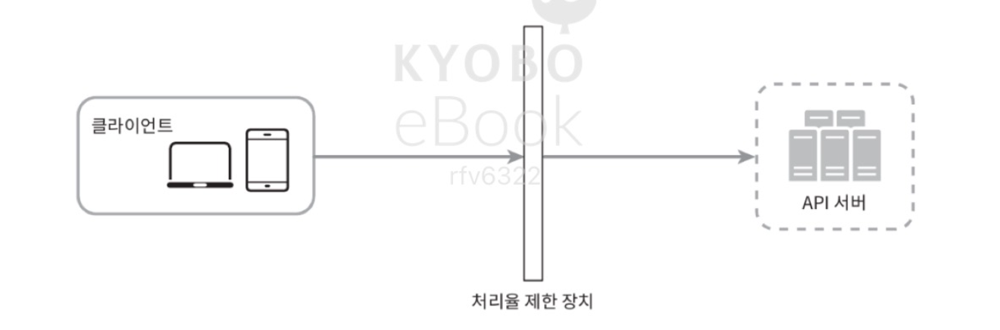
-> 처리율 제한 미들웨어를 만들어서 API 서버로 가는 요청을 통제

> **처리율 제한 장치는 코드로 구현하는 건지? 호출한 횟수도 다 저장해야 하는 건지?**   
> : 코드로 직접 구현할 수도 있고, 서비스를 이용할 수도 있음.  
> 코드로 직접 구현하는 경우에는 요청 횟수 저장소를 두고 기록함. 
> 1. 인메모리
> 2. redis, Memcached
> 3. DB
> 4. Api gateway, CDN 자체 저장  
> 
> 주로 redis를 많이 사용, 운영 편의성을 위해서는 보통 서비스를 이용하는 경우가 많음. 

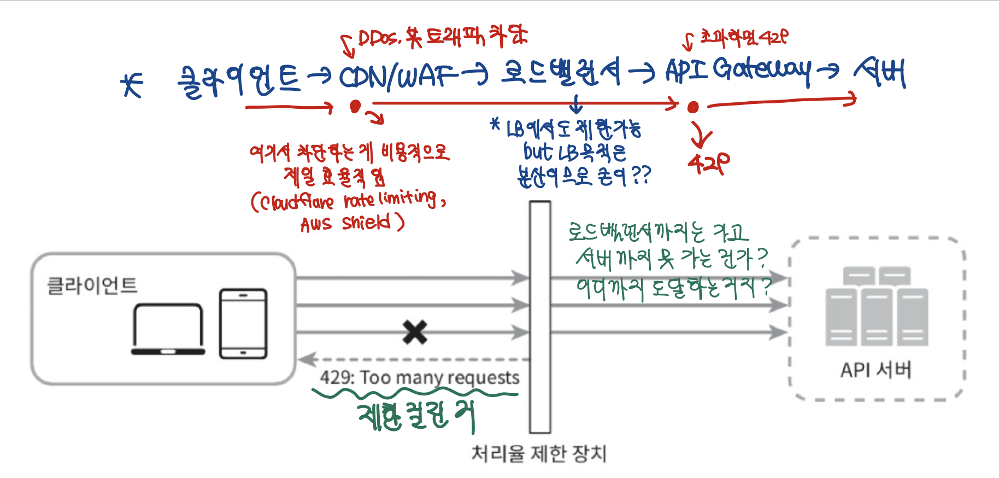

보통 클라우드 마이크로서비스의 경우, 처리율 제한 장치를 API 게이트웨이라고 불리는 컴포넌트에 구현.
  - API 게이트웨이 : 처리율 제한, SSL 종단, 사용자 인증, IP 허용 목록 관리 등을 지원하는 완전 위탁관리형 서비스
    > **그럼 개발자는 뭘 해야 하는 건지?**  
    Rate Limit 정책 정의 (어떤 단위로 제한할 건지? 얼마나? 예외는?)  
    서비스와 앱을 연결  
    모니터링, Fallback, Graceful Handling
  
---
    
#### 처리율 제한 장치를 설게할 때 고려할 지침

1. 프로그래밍 언어, 캐시 서비스 등 현재 사용하고 있는 기술 스택을 점검하고, 현재 사용 중인 프로그래밍 언어가 서버 측 구현을 지원하기 충분할 정도로 효율이 높은지 확인해라
2. 사업 필요에 맞는 처리율 제한 알고리즘을 찾아라. 
3. 설계가 마이크로서비스에 기반하고 있고, 사용자 인증이나 IP 허용목록 관리 등을 처리하기 위해 API 게이트웨이를 이미 설계에 포함시켰다면 처리율 제한 기능 또한 게이트웨이에 포함시켜야 할 수 있다
4. 상용 API 게이트웨이를 쓰는 것도 바람직하다.

> **서버 측 구현을 지원하기 힘든 언어도 있는지?**  
> -> 인터프리터형 스크립트 언어 등의 경우 힘들 수도 있음.

> **상용 API 게이트웨이 서비스에는 뭐가 있는지?**
> 
| Gateway / 서비스                          | 특징                         | Rate Limiting 지원                                            | 추가 사항                                          |
| -------------------------------------- | -------------------------- | ----------------------------------------------------------- | ---------------------------------------------- |
| **AWS API Gateway**                    | 서버리스, 클라우드 관리형             | ✅ IP, API Key, 사용자 단위 제한, 초당/분당/월간 요청 설정 가능                 | Free tier 있음, 정책별 quota 설정은 별도 지정, 유료 과금 발생 가능 |
| **Kong Gateway** (오픈소스)                | 플러그인 기반, 오픈소스 + Enterprise | ✅ Token bucket, Leaky bucket, Request per minute/hour 설정 가능 | Enterprise 버전은 고급 통계, 모니터링 제공                  |
| **Apigee (Google Cloud)**              | 엔터프라이즈용, 분석 기능 강력          | ✅ Key별, IP별, 서비스별 제한 가능                                     | 대부분 유료, Free trial 존재                          |
| **Nginx / Nginx Plus**                 | Reverse proxy + LB         | ✅ `limit_req`, `limit_conn` 등                               | Open-source는 기본 기능 무료  |
| **Envoy**                              | 클라우드 네이티브, 서비스 메쉬 지원       | ✅ Rate limiting filter 지원                                   | 외부 Redis 등과 연동해 분산 제한 가능                       |
| **Cloudflare / Akamai / Fastly** (CDN) | 엣지에서 Rate Limiting         | ✅ IP, URL, Header 기반 제한                                     | 일정 무료 한도 제공, 초과 시 유료              |
- Rate Limiter가 로드밸런서 앞에 있으면 서버 부담 최소화
- CDN/Edge가 있으면 외부 공격(DDoS)도 일부 완화 가능
- 필요 시 서버 단위로 사이드카 Rate Limiter 추가 → 분산 제한 가능

---

### 2. 처리율 제한 알고리즘

보통 널리 알려진 인기 알고리즘으로는 다섯 가지가 있음. 

1. 토큰 버킷
2. 누출 버킷
3. 고정 윈도 카운터
4. 이동 윈도 로그
5. 이동 윈도 카운터

---

### 토큰 버킷 알고리즘

간단하고 이해하기 쉬워서 보편적으로 많이 사용됨.  

**동작 원리**
- 토큰 버킷은 지정된 용량을 갖는 컨테이너. 사전 설정된 양의 토큰이 주기적으로 채워짐. 
- 토큰 공급기는 초마다 일정량의 토큰을 추가하고, 버킷이 가득 차면 추가로 공급되는 토큰은 버려짐. 
- 각 요청은 처리될 때마다 하나의 토큰을 사용.

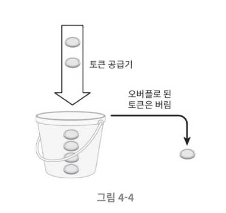

- 충분한 토큰이 있는 경우, 버킷에서 토큰 하나를 꺼낸 후 요청을 시스템에 전달. 
- 토큰이 없는 경우, 해당 요청은 버려짐.

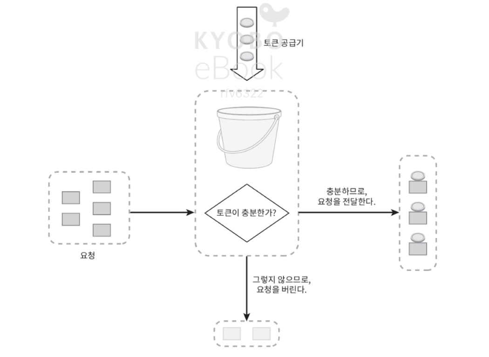  

- 토큰 버킷 알고리즘은 2개의 인자를 받음.
  - 버킷 크기 : 버킷에 담을 수 있는 토큰의 최대 개수
  - 토큰 공급률 : 초당 몇 개의 토큰이 버킷에 공급되는가
  
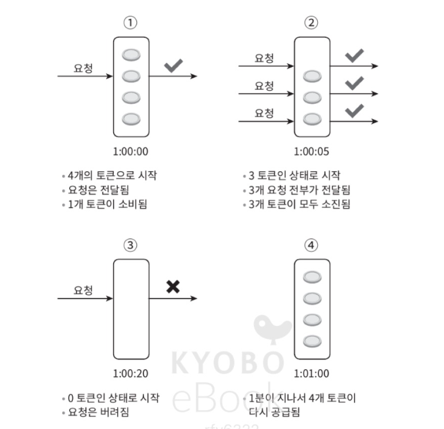

- 버킷은 몇 개나 두는지? 
  - 통상적으로 API 엔드포인트마다 별도의 버킷을 둠
  - 처리율을 제한해야 하는 단위의 개수에 맞춰서 버킷을 할당하는 것이 보통

- 장점 
  - 구현이 쉬움
  - 메모리 사용 측면에서 효율적
- 단점 
  - 버킷 크기와 토큰 공급률이라는 두 가지 인자를 적절하게 튜닝하기 까다로움

---

### 누출 버킷 알고리즘

요청 처리율이 고정되어 있음. FIFO 큐로 구현

**동작 원리** 

- 요청이 도착하면 큐가 가득 차 있는지 확인
- 큐에 빈자리가 있으면 요청을 추가
- 지정된 시간마다 큐에서 요청을 꺼내서 처리

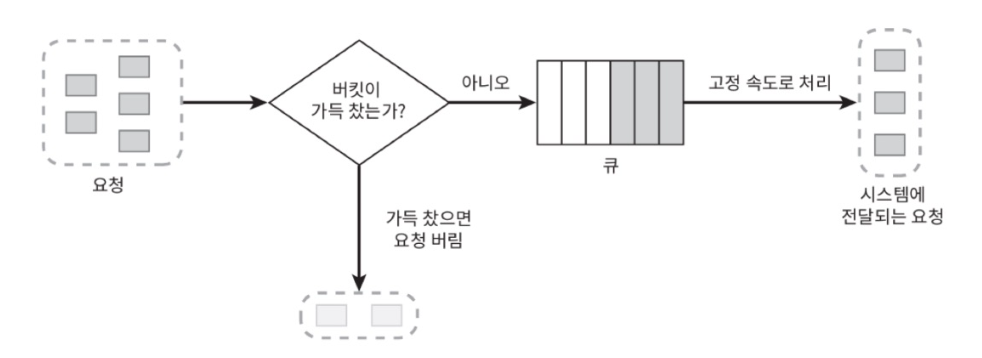

- 두 개의 인자를 사용
  - 버킷 크기 : 큐 사이즈와 같은 값
  - 처리율 : 지정된 시간 당 몇 개의 항목을 처리할지 지정. 보통 초 단위로 표현

- 장점
  - 큐의 크기가 제한되어 있어 메모리 사용량 측면에서 효율적
  - 안정적 출력이 필요한 경우에 적합
- 단점
  - 요청들을 제때 처리 못하면 최신 요청들은 버려지게 됨
  - 인자를 튜닝하기 까다로움

---

### 고정 윈도 카운터 알고리즘

**동작 원리**
- 타임라인을 고정된 간격의 윈도(window)로 나누고, 각 윈도마다 카운터를 둠
- 요청이 접수될 때마다 카운터의 값은 1씩 증가
- 카운터의 값이 사전에 설정된 임계치에 도달하면 새로운 요청은 새로운 윈도가 열릴 때까지 버려짐

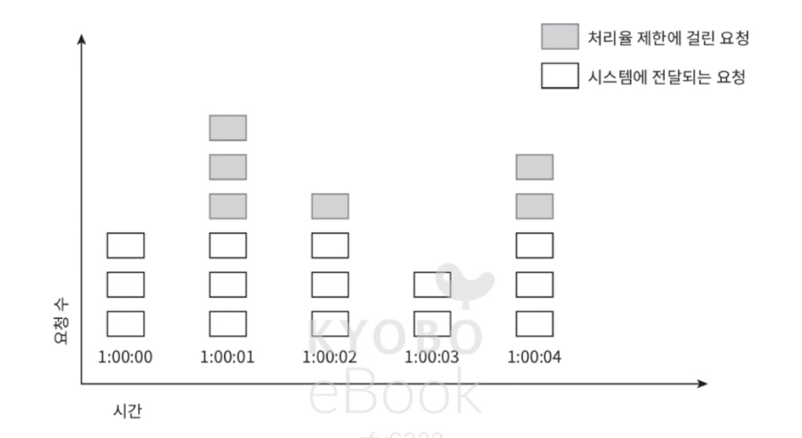

- 윈도의 경계 부근에 순간적으로 많은 트래픽이 집중될 경우 윈도에 할당된 양보다 더 많은 요청이 처리된 수 있음

- 장점
  - 메모리 효율이 좋음
  - 이해하기 쉬움
  - 윈도가 닫히는 시점에 카운터를 초기화하므로 특정한 트래픽 패턴을 처리하기에 적합함
- 단점
  - 윈도 경계 부근에 일시적으로 많은 트래픽이 몰려드는 경우 기대했던 처리 한도보다 많은 양의 요청을 처리하게 됨

---

### 이동 윈도 로깅 알고리즘

고정 윈도 알고리즘의 문제를 해결함 (윈도 경계 버스트)

**동작 원리**
- 요청의 타임스탬프를 추적 (보통 레디스의 정렬 집합 같은 캐시에 보관)
- 새로운 요청이 오면 만료된 타임스탬프는 제거하고 새 요청의 타임스탬프를 로그에 추가
- 로그의 크기가 허용치보다 같거나 작으면 요청을 시스템에 전달, 크면 처리를 거부

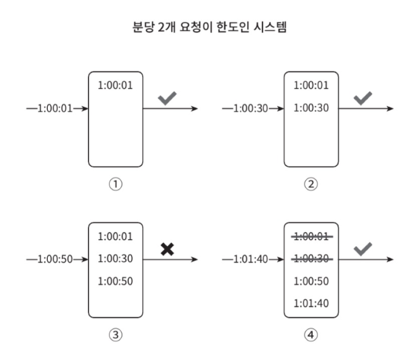
-> 분당 최대 2회의 요청만 처리가 가능한데 3번에서 세 번째로 요청이 들어옴   
-> 거부되는 요청의 타임스탬프는 로그에만 남고 처리는 거부됨

- 장점
  - 허용되는 요청의 개수는 항상 처리율 한도를 넘지 않음
- 단점 
  - 거부된 요청의 타임스탬프도 저장하므로, 다량의 메모리를 사용함

---

### 이동 윈도 카운터 알고리즘

= 고정 윈도 카운터 알고리즘 + 이동 윈도 로깅 알고리즘

두 가지 방법으로 구현할 수 있음. 그 중 하나의 **동작 원리**

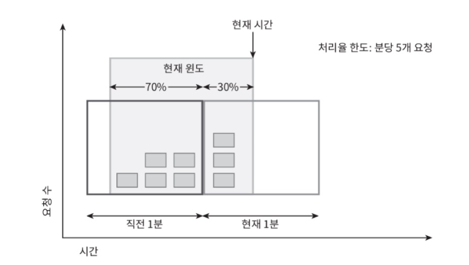
-> 현재 윈도에 들어 있는 요청 = 3+5*70%=6.5개

- 장점
  - 짧은 시간에 몰리는 트래픽에도 잘 대응함
  - 메모리 효율이 좋음
- 단점
  - 직전 시간대에 도착한 요청이 균등하게 분포되오 있다고 가정한 상태에서 추정치를 계산하기 때문에 다소 느슨함.
    -> 심각한 수준은 아님

---

### 개략적인 아키텍처

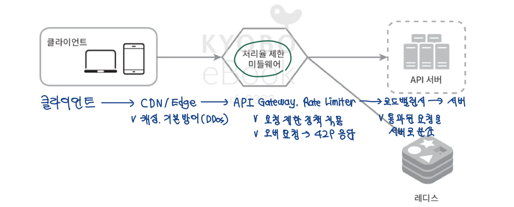

- 카운터는 보통 Redis에 보관
- 메모리 상에서 동작하고, 만료 정책을 지원하기 때문에 캐시가 바람직함

> **캐시 서버랑 별개로 카운터 저장을 위한 Redis를 추가한 건지?**   
> : 직접 코드로 구현하는 경우 추가해줘야 하고, 서비스를 이용하는 경우에는 알아서 해줌

**동작 원리**
1. 클라이언트는 처리율 제한 미들웨어에 요청을 보냄
2. 처리율 제한 미들웨어는 레디스의 지정 버킷에서 카운터를 가져와서 한도에 도달했는지 검사
3. 한도에 도달한 경우 HTTP 429 반환
4. 도달하지 않은 경우 요청을 서버로 전달
5. 미들웨어는 카운터의 값을 증가시키고 다시 저장

---

### 처리율 제한 규칙

리프트는 처리율 제한에 오픈소스를 사용하고 있다. 
> **리프트**는 미국의 차량 공유 서비스로, **Envoy 프록시를 개발**함.  
> 글로벌 처리율 제한 기능을 설계해서 대규모 시스템 내 전체 서비스에 대한 요청을 중앙에서 처리할 수 있도록 함. 

---

### 처리율 한도 초과 트래픽의 처리

- 요청이 한도 제한에 걸리면 API는 **HTTP 429 (too many requests) 응답**을 보냄
- 경우에 따라서는 한도 제한에 걸린 요청을 큐에 보관할 수도 있음

---

#### 처리율 제한 장치가 사용하는 HTTP 헤더

- X-Ratelimit-Remaining : 윈도 내에 남은 처리 가능 요청의 수
- X-Ratelimit-Limit : 매 윈도마다 클라이언트가 전송할 수 있는 요청의 수
- X-Ratelimit-Read-after : 한도 제한에 걸리지 않으려면 몇 초 후에 요청을 다시 보내야 하는지 알림  

-> 다음과 같은 내용을 헤더에 포함해서 반환

---

### 상세 설계

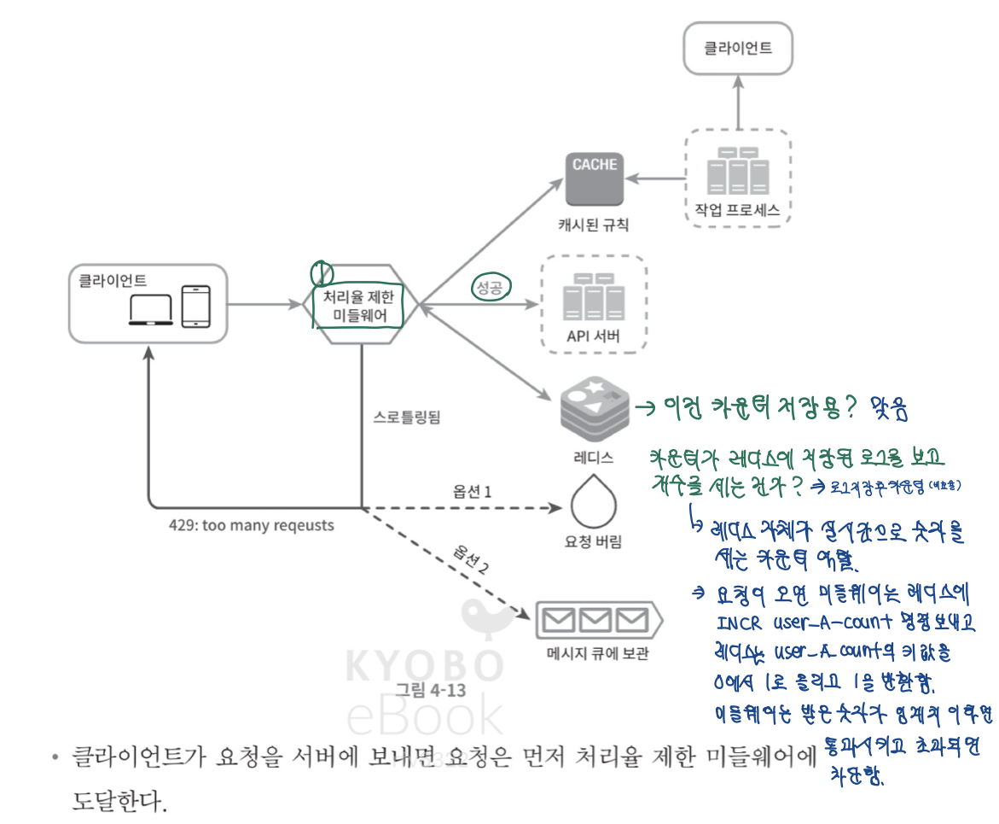

**동작 원리**
- 요청을 서버에 보내면 처리율 미들웨어에 먼저 도달함
- 처리율 미들웨어가 제한 규칙을 캐시에서 가져오고, 카운터 및 마지막 요청의 타임스탬프를 레디스 캐시에서 가져옴
- 요청이 처리율 제한에 걸리지 않은 경우 서버로 보냄
- 요청이 처리율 제한에 걸린 경우 HTTP 429 (too many requests) 응답을 보냄
  - 요청은 버릴 수도 있고 메시지 큐에 보관할 수도 있음

---

### 분산 환경에서의 처리율 제한 장치의 구현

단일 서버를 지원하는 처리율 제한 장치의 경우에는 구현이 쉬움  
여러 대의 서버와 병렬 스레드를 지원해야 하는 경우 두 가지 문제를 풀어야 함

1. 경쟁 조건
  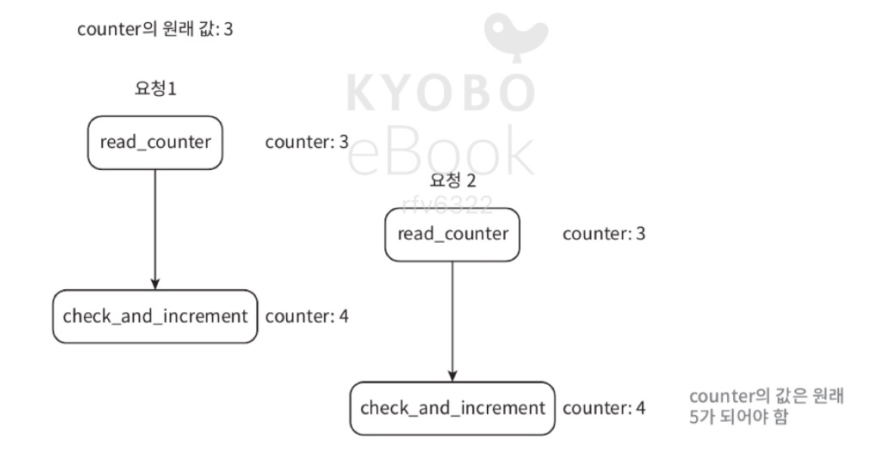

- 해결 방법 
  - 락(lock)이 가장 널리 알려진 해결 방법이지만 시스템의 성능을 떨어뜨림
  - 루아 스크립트 사용
  - 정렬 집합 사용

2. 동기화
  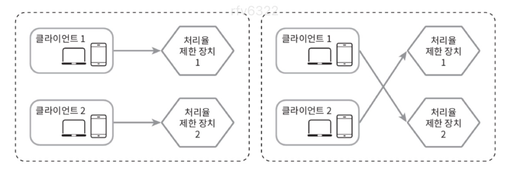

- 해결 방법
  - 고정 세션 (session sticky) 사용하면 되지만 유연하지도 않고 확장 X, 로드밸런서 부하 문제 심함
  - Redis 같은 중앙 집중형 데이터 저장소 사용
  

---

#### 성능 최적화

1. 데이터센터 지원
   - 엣지 서버를 사용해서 latency를 줄이기
2. 제한 장치 간에 데이터를 동기화할 때, 최종 일관성 모델 사용

#### 경성 또는 연성 처리율 제한

- 경성 처리율 제한 : 요청의 개수는 임계치를 절대 벗어날 수 없다.
- 연성 처리율 제한 : 요청 개수는 잠시 동안은 임계치를 넘어설 수 있다. 

#### 처리율 제한을 회피하는 방법
- 클라이언트 측 캐시를 사용해서 API 호출 횟수를 줄이자
- 처리율 제한의 임계치를 확인하고, 짧은 시간 동안 너무 많은 메시지를 보내지 않도록 하자
- 예외나 에러 처리 코드를 도입하자
- 재시도 로직을 구현할 때에는 충분한 백오프 시간을 두자

---

### 다양한 계층에서의 처리율 제한

- 해당 장에서는 애플리케이션 계층에서의 처리율 제한에 대해서만 다룸  
- 네트워크 계층에서도 처리율 제한 가능
  > IP 주소나 포트를 기준으로 데이터 패킷의 흐름을 제어하는 방식.  
  > - 네트워크 인프라 전체의 안정성과 품질을 보장
  > - 특정 소스에서 발생하는 과도한 트래픽이 전체 네트워크를 마비시키는 것을 방지하거나, 중요한 트래픽이 지연되지 않도록 대역폭을 보장함.  
  > - 트래픽을 특정 패턴에 맞춰 전송되도록 조절하여 네트워크를 안정적으로 유지  
  > - 유사하게 토큰 버킷, 누출 버킷 알고리즘을 사용하지만 구현되는 위치와 대상이 다름.

