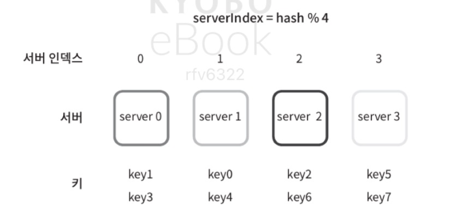
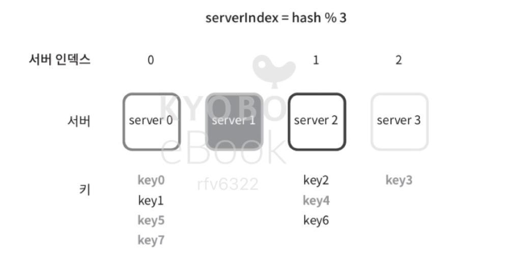
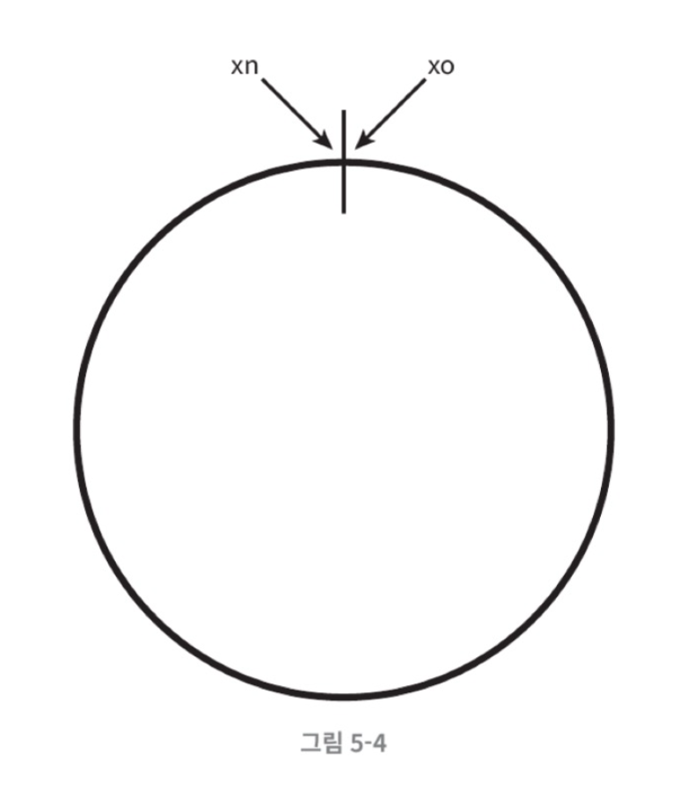
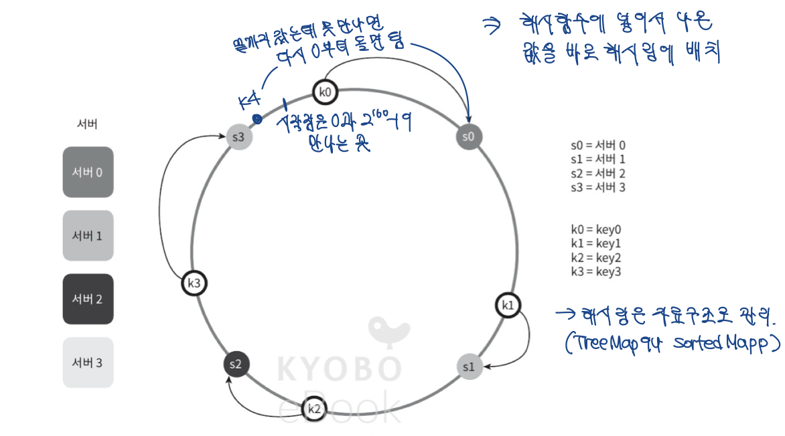
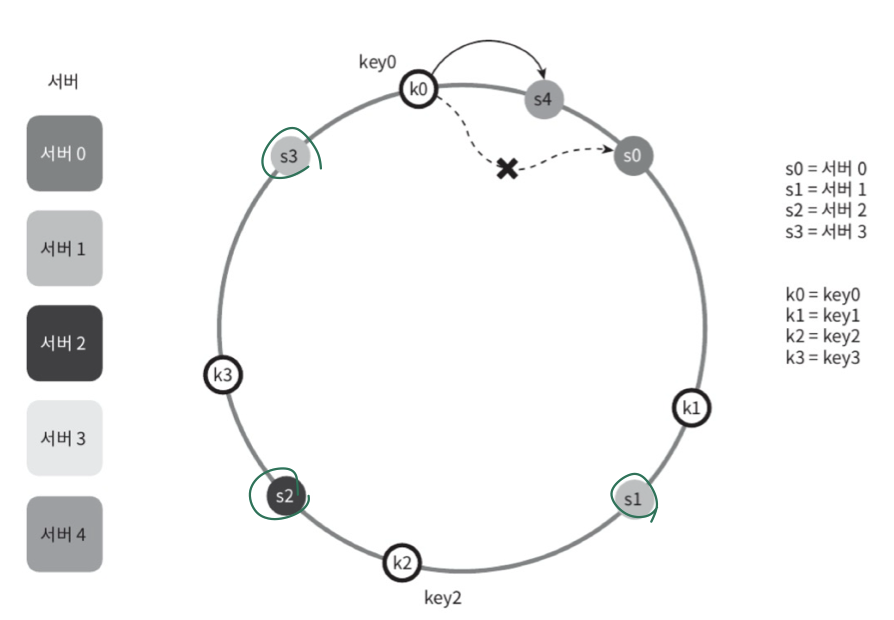
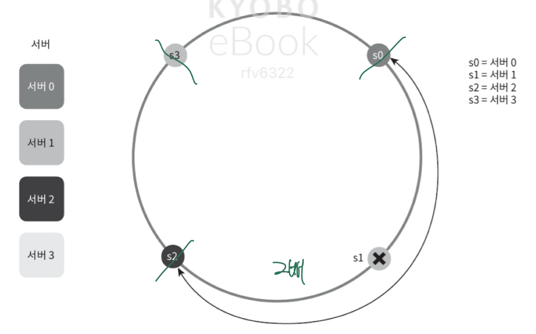
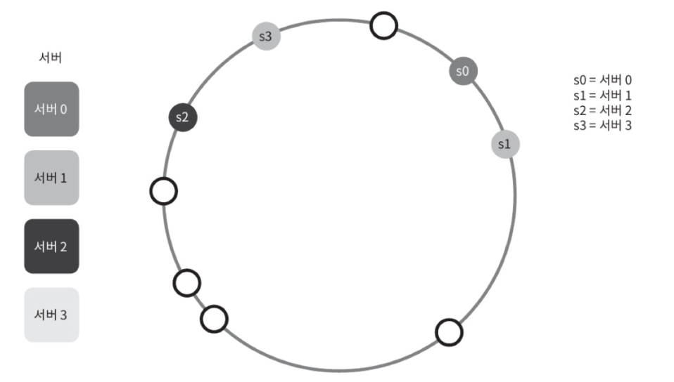
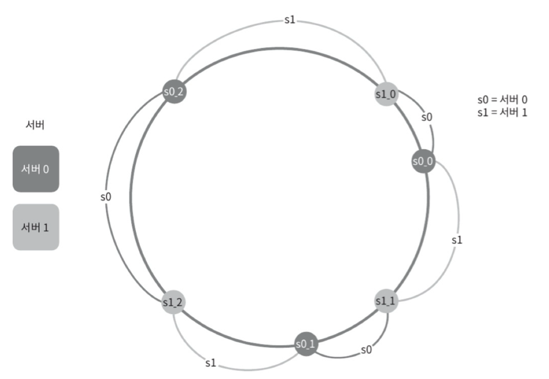

## 5장. 안정 해시 설계

### 1. 해시 키 재배치 문제

보통 n개의 서버들에 부하를 균등하게 나누는 보편적인 방법은 해시 함수를 사용하는 것.   
server = hash(key) % N


: 서버 풀의 크기가 고정되어 있는 경우, 데이터 분포가 균등한 경우에는 잘 작동함.  


: 서버가 추가되거나 기존 서버가 삭제되는 경우, 키에 대한 해시 값은 변하지 않지만 나머지 연산을 적용한 결과가 달라지기 때문에 서버 인덱스 값이 달라짐.  
=> **대규모 캐시 미스 발생**

---

### 2. 안정 해시

= 해시 테이블 크기가 조정될 때, k/n개의 키만 재배치하는 해시 기술

```
안정 해시는 서버 개수가 변해도 일부만 재배치하면 되무로 데이터 이동을 최소화 할 수 있음. 
서버가 자주 바뀌는 환경에서 유리하고, 노드 추가/삭제가 많아도 큰 해시 비용이 들지 않음. 
```

---

### 3. 해시 공간과 해시 링

- **동작 원리**
  - 해시 함수 f는 SHA-1을 사용한다고 하고, 그 함수의 출력 값 범위는 x0, x1, x2 ... xn과 같다고 할 때, SHA-1의 해시 공간 범위는 2^160-1이라고 알려져 있음. 
  - 그러므로 해시 공간은 0부터 2^160-1까지의 값을 가지는데, 이 공간의 양끝을 구부려서 원을 만든 것이 해시 링.


```
Secure Hash Algorithm 1, 임의의 입력을 20바이트의 고정된 해시 값으로 반환. 
(보안상 더이상 안전하진 않지만) 분포 균등성, 계산 속도, 널리 구현되어 있음 등의 이유로 자주 쓰임.
-> DynamoDB, Cassandra에도 사용됨.


해시 링은 실제로 배열이나 정렬 맵(TreeMap, Red-Black Tree, SkipList) 같은 자료구조로 메모리에 올려서 관리.  
해시 공간 전체(예: 0 ~ 2^160)를 다 메모리에 할당하는 것이 아니라,   
서버의 해시 값만 저장해 두고, 키가 들어올 때마다 계산해서 가장 가까운 서버를 찾는 방식.  
링은 개념적으로는 거대한 원이지만, 실제로는 정렬된 서버 좌표 목록만 관리한다고 볼 수 있음. 
```

자바에서는 TreeMap을 써서 구현

```
SortedMap<Integer, String> ring = new TreeMap<>();
ring.put(hash("ServerA"), "ServerA");
ring.put(hash("ServerB"), "ServerB");

int keyHash = hash("user123");
SortedMap<Integer, String> tailMap = ring.tailMap(keyHash);
String targetServer = tailMap.isEmpty() ? ring.get(ring.firstKey()) : ring.get(tailMap.firstKey());
```

---

### 4. 안정 해시를 사용한 서버 조회

해시 함수 f를 이용하면 서버 IP나 이름을 링 위의 위치에 대응시킬 수 있음.  
일반적인 해시 분산에서는 위에서 언급한 공식을 사용하지만, 안정 해시는 나머지 연산을 사용하지 않고 해시 함수만으로 서버와 키를 링 위에 흩뿌림. 



키는 해당 위치로부터 시계 방향으로 링을 탐색하며 만나는 첫 번째 서버에 저장됨.  
만약 링의 끝부분까지 갔는데도 서버를 만나지 못했다면 이어진 0부터 계속 탐색을 이어감.

### **서버가 추가되면?** 


: 서버가 추가되었음에도 k0만 재배치 된 것을 확인할 수 있음. 

---

### 5. 기본 구현법의 두 가지 문제
- 기본 절차
  - 서버와 키를 균등 분포 해시 함수를 이용해 해시 링에 배치.
  - 키의 위치에서 링을 시계 방향으로 탐색하다 만나는 최초의 서버가 키에 저장될 서버.

- **문제점**
  - 서버가 추가되거나 삭제되는 경우 파티션의 크기를 균등하게 유지하는 게 불가능함.
  

  - 키의 균등 분포를 달성하기 어려움
  

---

### 6. 가상 노드

위의 문제점을 해결하기 위해 제안된 기법이 가상 노드.
하나의 서버는 링 위에 여러 개의 가상 노드를 가짐으로써 각 서버는 여러 개의 파티션을 관리. 





가상 노드의 개수를 늘릴수록 키의 분포가 점점 균등해짐.  
100 ~ 200개의 가상 노드를 사용했을 경우 표준 편차 값이 평균의 5%에서 10% 사이.  
그러나 가상 노드를 많이 사용할 수록 가상 노드 데이터를 저장할 공간이 더 많이 필요해짐.  
=> 타협적 결정 필요

```
너무 적으면? -> 부하 불균형, 일부 서버에만 키가 몰림
너무 많으면? -> 자료구조 크기가 늘어나고 재배치 비용이 많이 듦. 관리 오버헤드.
```


```
Q. 보통 몇 개나 사용하는지??
요새는 32개에서 100개 정도로 타협을 보는 경우가 많은데, 
서버 수가 5대에서 20대 사이라면 서버당 100 ~ 200개를 사용하고 
그 이상이면 서버당 vnode 개수를 줄여도 됨. (어차피 균등해지므로)
```

---

### 7. 재배티할 키 결정

서버가 추가되거나 제거되면 데이터 일부를 재배치해야 하지만, 추가되거나 제거된 서버의 범위 내에 있는 키만 재배치하면 됨. 

```
Q. 키를 재배치하는 방법은? 
캐시라면 읽어서 옮기거나 캐시 미스가 날 때마다 새로 채우고, 
DB라면 데이터를 복제해서 새 서버로 해당 파티션 데이터를 옮김. 
```

---

## 추가

### 1. Dynamo의 안정 해시 설계

- **키 해싱**

   * 키에 MD5 해시(128-bit) 적용 → 링의 위치로 매핑
- **노드 배치**
  - 물리 노드를 여러 개의 가상 노드로 분할
  - 동일 물리 노드가 링 위 여러 지점을 갖도록 하여 부하 균등화
- **데이터 복제**
  - 키 해시 → 시계방향으로 첫 번째 노드를 복제 대상으로 선택
- **데이터 정합성 검증**
   - **Merkle Tree** 사용 
   - 동일 키 범위를 담당하는 노드끼리 루트만 비교 후, 차이가 있는 하위 범위만 동기화 → **네트워크/IO 오버헤드 절감**
  

### 2. 디스코드의 안정 해시 기반 아키텍처

- **안정 해시 기반 라우팅**

  - 메시지 서비스에 대해 채널 단위로 해시
  - 동일 채널 요청은 항상 동일한 서비스 인스턴스로 전달
  - 데이터 일관성 보장 및 DB 부하 감소

- **요청 집합화**

  - 동일 리소스에 대한 여러 요청을 **하나로 병합 처리**
  - 예: 수천 명이 동시에 같은 채널에 메시지 → 하나의 batch로 Cassandra에 전송
  - 효과:

      - 네트워크 요청 수 감소
      - Cassandra I/O 효율 향상
      - 노드 부하 완화

- **스키마 설계 및 샤딩**

  - **Cassandra 기반 샤딩** → 각 채널을 파티션 단위로 저장
  - **Murmur3 해시** 사용
  - 채널 단위 샤딩으로 데이터 균등 분포
  - 특정 채널에 트래픽이 몰리면 **핫 파티션 문제 발생**


### 3. 핫 파티션 문제와 디스코드의 대응

####  문제: 특정 채널에 트래픽 집중

* 특정 채널 ID → 해시 값이 특정 파티션에 몰림
* 해당 노드가 **쓰기/읽기 요청 폭주**로 CPU, I/O, 네트워크 병목
* 다른 노드는 유휴 상태 → **자원 불균형 발생**

####  해결책

1. **안정 해시 기반 라우팅**
   * 가상 노드 수 조정 → 핫 파티션 키를 다른 서버로 분산
   * 서버 추가/삭제/분할 시 데이터 재배치 최소화

2. **요청 집합화**
   * 동일 채널 요청 → 하나의 batch로 Cassandra에 전송
   * I/O 효율 최적화 및 latency 감소

3. **Adaptive Capacity (Hot Key 분할)**
   * 트래픽 폭주한 특정 파티션만 분할
   * 동적으로 부하를 분산

