## 6. 키-값 저장소 설계

키-값
저장소 : 비 관계형 데이터베이스  
- 고유 식별자를 키로 가져야 하고, 값은 키를 통해서만 접근할 수 있음.
- 키는 일반 텍스트일 수도 있고, 해시 값일 수도 있고, 짧을수록 좋음. 
- 값으로는 무엇이든 올 수 있음. 
- AWS DynamoDB, memcached, Redis
- put(key, value), get(key) 연산을 지원함.

---

### 문제 이해 및 설계 범위 확정

- 키-값 쌍의 크기는 10KB 이하이다. 
- 큰 데이터를 저장할 수 있어야 한다.
- 높은 가용성을 제공해야 한다. 따라서 시스템은 설사 장애가 있더라도 빨리 응답해야 한다. 
- 높은 규모 확장성을 제공해야 한다. 따라서 트래픽 양에 따라 자동적으로 서버 증설/삭제가 이루어져야 한다. 
- 데이터 일관성 수준은 조정이 가능해야 한다.
- 응답 지연시간이 짧아야 한다. 

---

### 1. 단일 서버 키-값 저장소

단일 서버를 사용하는 경우 키-값 쌍을 모두 메모리에 해시 테이블로 저장하면 간단함.  
-> 빠른 속도를 보장하지만 메모리 용량 제한이 있을 수 있음. 

- 데이터 압축
- 자주 쓰이는 데이터만 메모리에 두고 나머지는 디스크에 저장

두 가지 방법으로 개선이 가능하지만 단일 서버로는 부족할 때가 옴.  
이 때 사용하는 것이 분산 저장소

---

### 2. 분산 키 값 저장소

#### CAP 정리

- 데이터 일관성, 가용성, 파티션 감내라는 세 가지 요구사항을 동시에 만족하는 분산 시스템을 설계하는 건 불가능하다.

  - 데이터 일관성 (Consistency) : 분산 시스템에 접속하는 모든 클라이언트는 어떤 노드에 접속했느냐에 관계없이 언제나 같은 데이터를 보게 되어야 함. 
  - 가용성 (Availability) : 분산 시스템에 접속하는 클라이언트는 일부 노드에 장애가 발생하더라도 항상 응답을 받을 수 있어야 함.
  - 파티션 감내 (Partition tolerance) : 파티션은 두 노드 사이에 통신 장애가 발생하였음을 의미. 파티션 감내는 네트워크에 파티션이 생기더라도 시스템은 게속 동작해야 한다는 것. 

```
정리하자면,  

C (Consistency) — 모든 노드가 동일한 데이터를 보여줌.  
A (Availability) — 항상 응답을 반환함.  
P (Partition tolerance) — 네트워크 분할(일부 노드 간 통신 단절)이 일어나도 시스템이 계속 동작함.
```

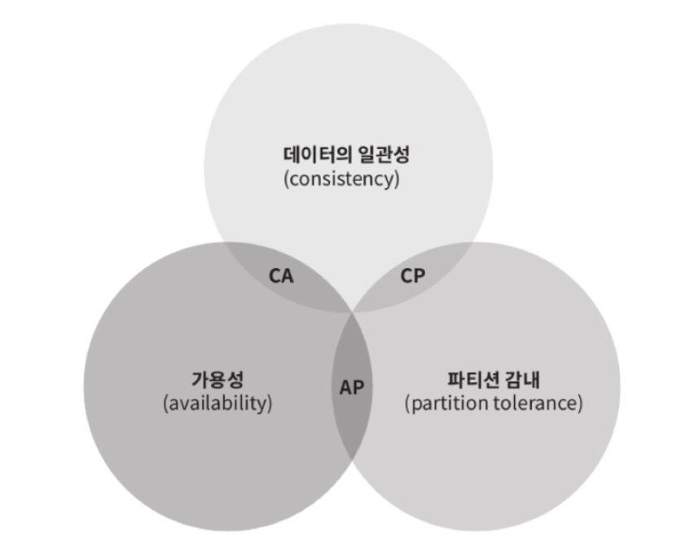

- **CP 시스템** : 일관성과 파틴션 감내를 지원.
  - 네트워크가 끊어지면, 데이터 불일치를 막기 위해 일부 요청을 거부함.
    모든 노드의 데이터가 일관되게 맞을 때만 응답을 반환함.


- **AP 시스템** : 가용성과 파티션 감내를 지원.
  - 네트워크가 끊어져도, 각 노드는 자신이 가진 최신 데이터로 응답함.
    나중에 네트워크가 복구되면 데이터 동기화(최종 일관성, eventual consistency)로 맞춰짐.


- **CA 시스템** : 일관성과 가용성을 지원. 
  - 통상 네트워크 장애는 피할 수 없는 일로 여겨지므로, 분산 시스템은 반드시 파티션 문제를 감내할 수 있도록 설계되어야 함. 그러므로 존재하지 않음. 
  - 네트워크가 분리되지 않는 환경이라면, 일관성과 가용성을 모두 가질 수 있음. 
  - 즉, 단일 서버 환경, 혹은 파티션이 발생하지 않는 내부 시스템.

| 구분    | 포기 속성  | 특징              | 대표 사례                  | 사용 예시           |
| ----- |--------| --------------- | ---------------------- | --------------- |
| **CP** | 가용성    | 정확성 우선, 느려도 괜찮음 | Zookeeper, HBase, etcd | 은행, 결제, 트랜잭션    |
| **AP** | 일관성    | 빠름, 일시적 불일치 허용  | Cassandra, DynamoDB    | SNS, 채팅, 로그 시스템 |
| **CA** | 파티션 감내 | 단일 서버만 가능       | MySQL(단일), Oracle      | 내부 시스템, 단일 DB   |


    
##### 이상적 상태
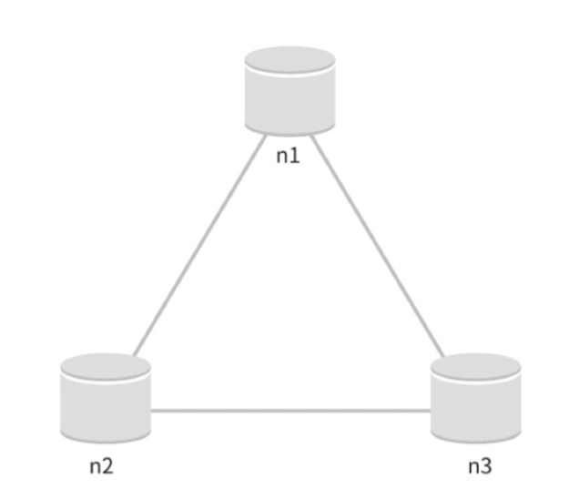

##### 실세계의 분산 시스템
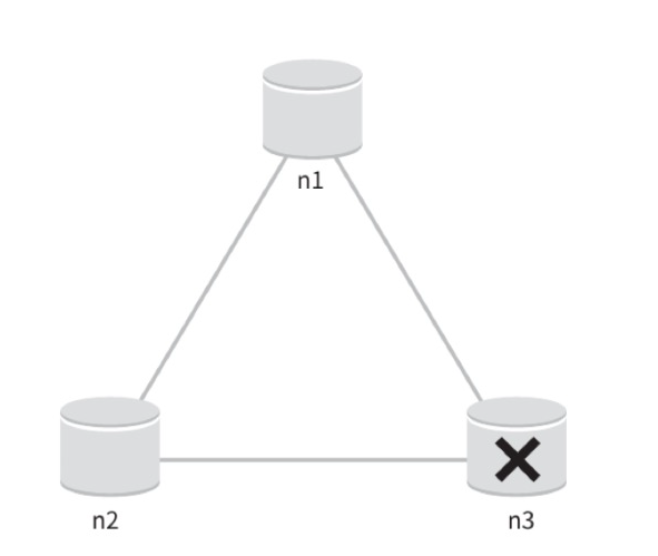  

- 분산 시스템은 파티션 문제를 피할 수 없음. 이 경우 우리는 일관성과 가용성 중 하나를 선택해야 함.  

**(1). 일관성을 선택할 경우 (CP 시스템)**
- 데이터 불일치 문제를 피하기 위해 n1, n2에 대해 쓰기 연산을 중단 시켜야 함 -> 가용성 깨짐. 
- 데이터의 정확성이 매우 중요하고, 잠깐의 장애보다 정합성이 중요할 경우 사용.

**(2). 가용성을 선택할 경우 (AP 시스템)**
- 낡은 데이터를 반환하더라도 읽기 연산을 계속 허용해야 함. 
- 데이터 일관성보다도 서비스 중간이 더 큰 리스크일 경우 사용. 


---

### 시스템 컴포넌트

### 1. 데이터 파티션

데이터를 작은 파티션들로 분할한 다음 여러 대의 서버에 저장하는 것이 가장 간단함.   
-> 두 가지 문제를 중요하게 따져 보아야 함.  

- 데이터를 여러 서버에 고르게 분산할 수 있는가? 
- 노드가 추가되거나 삭제될 때 데이터의 이동을 최소화할 수 있는가? 

앞서 5장에서 배운 안정 해시를 사용할 경우
1. 규모 확장 자동화 (automatic scaling) : 시스템 부하에 따라 서버가 자동으로 추가되거나 삭제되도록 만들 수 있음.
2. 다양성 (heterogeneity) : 각 서버의 용량에 맞게 가상 노드의 수를 조정할 수 있음. 

#### 데이터 다중화

높은 가용성, 안전성 확보를 위해서는 데이터를 N개 서버에 비동기적으로 다중화 해야 함.  

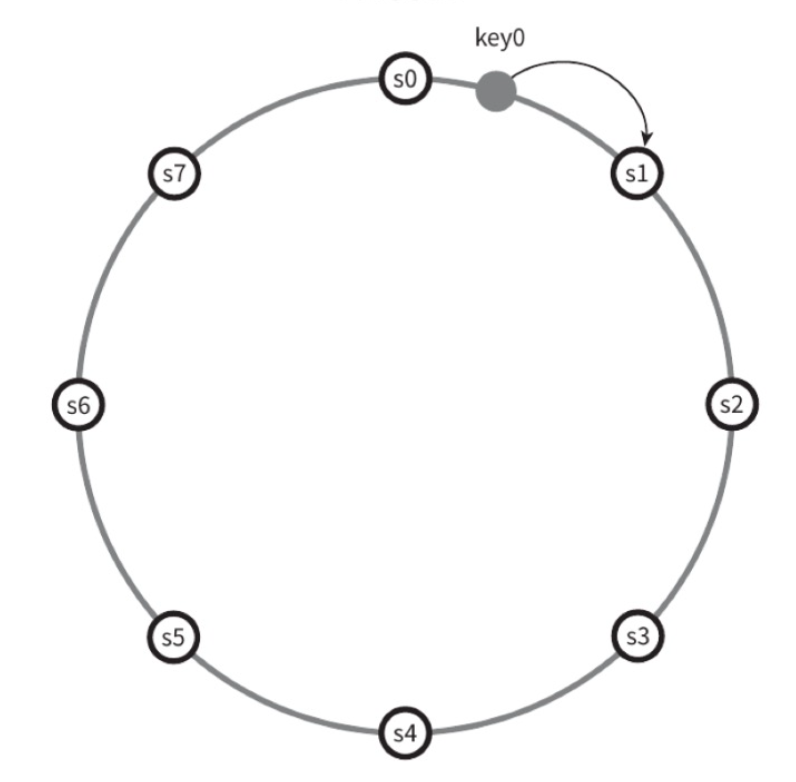

- 시계 방향으로 만나는 첫 N개 서버에 데이터의 사본을 저장하는 방식. 
- N이 3이라면 key0에 대한 사본을 s1, s2, s3에 저장하게 됨. 
- 다만 가상 노드를 사용할 시에 N개의 노드가 대응되는 실제 물리 서버의 개수가 N보다 작아질 수 있음. -> 같은 물리 서버를 중복 선택하면 안 됨. 
- 안정성을 담보하기 위해 보통 데이터의 사본은 다른 센터의 서버에 보관하고, 센터들은 고속 네트워크로 연결함. 

### 데이터 일관성

여러 노드에 다중화된 데이터는 적절히 동기화되어야 하는데, 정족수 합의 프로토콜을 사용하면 읽기/쓰기 연산에 일관성을 보장할 수 있음. 

```
정족수 합의 (Quirum Consensus) 프로토콜 

정족수(quorum)란 의사결정을 내리기 위해 필요한 최소한의 동의 수를 뜻함.

- 장애 노드가 있어도 동작 가능
- 네트워크 분할 시에도 일부분이 계속 서비스 가능
- 일관성 수준을 설정으로 조정 가능

- 쓰기 지연 발생 가능 (W 노드 기다려야 함)
- 일시적 데이터 불일치 발생 가능
- 노드 수 늘릴수록 관리 복잡

```

N = 사본 개수  
W = 쓰기 연산에 대한 정족수 (쓰기 연산이 성공한 것으로 간주되려면 적어도 W개의 서버로부터 쓰기 연산이 성공했다는 응답을 받아야 함)  
R = 읽기 연산에 대한 정족수 (읽기 연산이 성공한 것으로 간주되려면 적어도 R개의 서버로부터 읽기 연산이 성공했다는 응답을 받아야 함)  

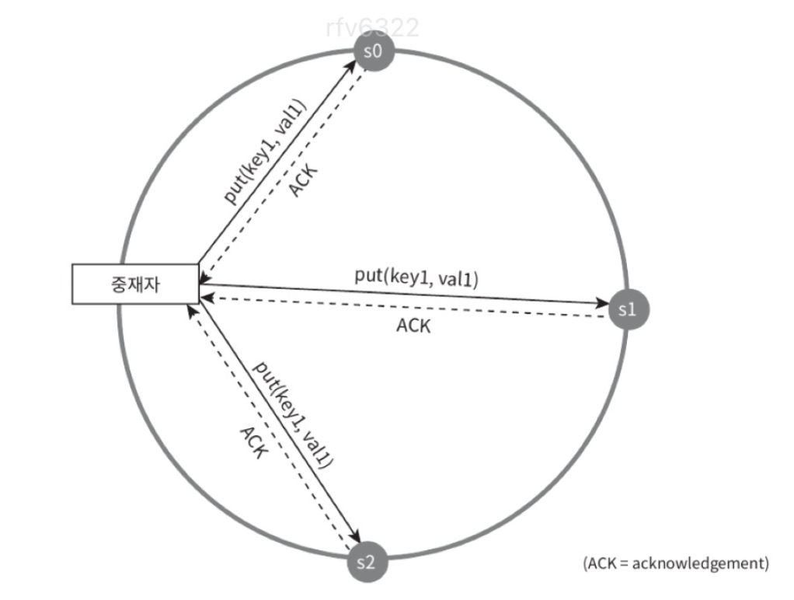

중재자가 클라이언트와 노드 사이에서 proxy 역할을 함.
- 서버로부터 W/R개 이상의 응답을 받을 때까지 기다리는 것

R=1, W=N : 빠른 읽기 연산에 최적화된 시스템
W=1, R=N : 빠른 쓰기 연산에 최적화된 시스템
W+R > N : 강한 일관성이 보장됨 (보통 N=3, R=N=2)
W+R <= N : 강한 일관성이 보장되지 않음 (약한 일관성)

#### 실제 사용 예시  

| 시스템                       | 사용 방식                                                         |
| ------------------------- | ------------------------------------------------------------- |
| **Amazon DynamoDB**       | R, W 설정 가능 — 최종 일관성(Eventual) 또는 강한 일관성(Strong) 선택 가능         |
| **Apache Cassandra**      | `QUORUM`, `ONE`, `ALL` 등의 일관성 수준으로 R/W 조합 조정                  |
| **Riak**                  | Dynamo 기반 — R+W>N 규칙 사용                                       |
| **MongoDB (Replica Set)** | Primary/Secondary 구조에서 write concern, read concern 설정으로 유사 구현 |


### 일관성 모델

- 강한 일관성
  - 모든 읽기 연산은 가장 최근에 갱신된 결과를 반환. 클라이언트는 절대로 낡은 데이터를 보지 못함. 
- 약한 일관성
  - 읽기 연산은 가장 최근에 갱신된 결과를 반환하지 못할 수 있음. 
- 최종 일관성 
  - 약한 일관성의 한 형태로, 갱신 결과가 결국에는 모든 사본에 반영(동기화)되는 모델

강한 일관성은 고가용성 시스템에는 적합하지 않음. 보통 Dynamo, 카산드라는 최종 일관성 모델을 선택.

| 구분         | 설명                | 장점            | 단점            | 사용 예시                    |
| ---------- | ----------------- | ------------- | ------------- | ------------------------ |
| **강한 일관성** | 모든 읽기가 최신 데이터 보장  | 데이터 정확성 높음    | 속도 느림, 가용성 낮음 | 결제, 은행, 재고관리             |
| **약한 일관성** | 최신 데이터 아닐 수도 있음   | 빠른 응답, 가용성 높음 | 데이터 불일치 가능    | 로그, 캐시, 분석 시스템           |
| **최종 일관성** | 시간이 지나면 모든 사본이 일치 | 빠르고 가용성 높음    | 일시적 불일치       | SNS, DynamoDB, Cassandra |


### 비 일관성 해소 기법

데이터를 다중화하면 가용성은 높아지지만 사본 간 일관성이 깨질 가능성이 높아짐. 

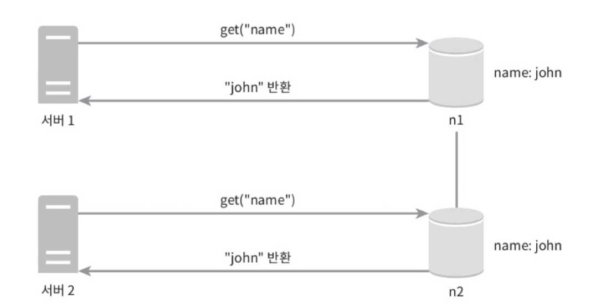
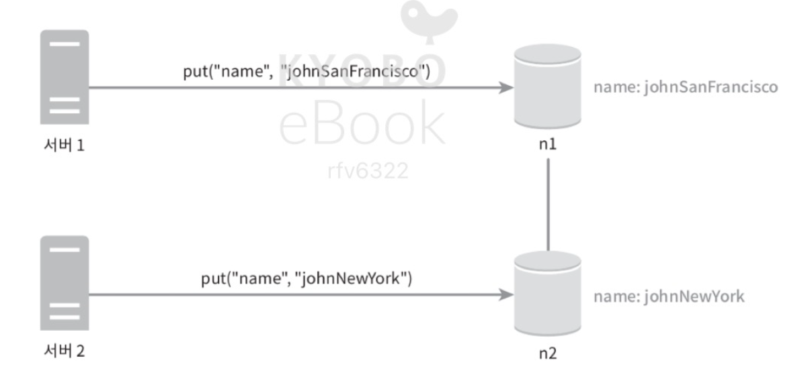
-> 일관성이 깨짐

✔️ **버저닝 (versioning)** : 데이터를 변경할 때마다 해당 데이터의 새로운 버전을 만드는 것.
  - 각 버전의 데이터는 변경 불가능. 


✔️ **벡터 시계** : [서버, 버전]의 순서쌍을 데이터에 매단 것. 
  - 어떤 버전이 선행/후행 버전인지, 다른 버전과의 충돌이 있는지 판별하는 데에 사용함. 
  - 이벤트 간의 인과 관계(causal relationship) 를 추적하기 위한 논리적 타임스탬프(logical timestamp) 기법.
  - 시스템에는 여러 노드(Node)가 존재하고, 각 노드는 자신만의 카운터(clock) 를 가짐.  
    이벤트가 발생할 때마다 자신의 카운터를 +1 증가시킴.  
    메시지를 주고받을 때는 현재의 벡터 시계를 함께 전송하여 인과 관계를 파악함.

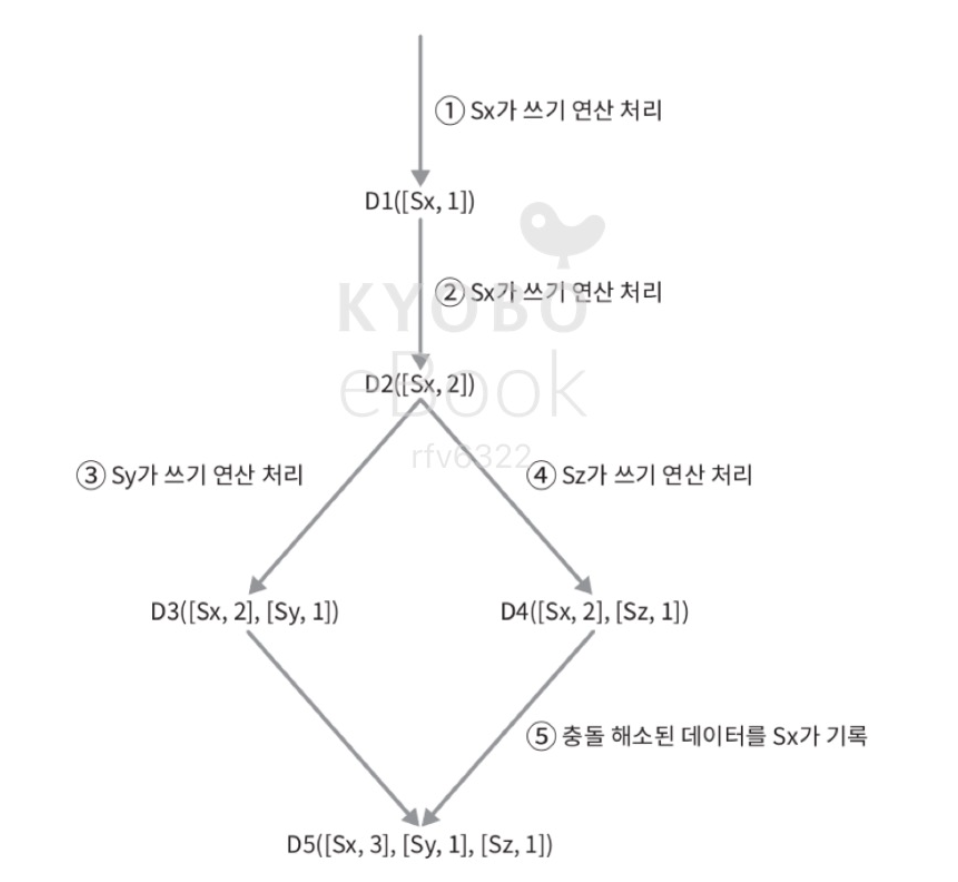

- 작동 원리
  1. 자신의 이벤트 발생   
   → 자신의 카운터를 +1  
   → 예: A가 이벤트 발생 시 → A:3 → 4  
  2. 메시지 송신 시  
   → 자신의 벡터 시계를 메시지에 포함하여 전송.  
  3. 메시지 수신 시  
   → 수신자는 자신의 벡터 시계와 메시지의 벡터 시계를 요소별로 최대값(max) 으로 병합.  
   → 이후 자신의 카운터를 +1 증가.  


- 벡터 시계 단점
  1. 충돌 감지 및 해소 로직이 클라이언트에 들어가야 하므로 클라이언트 구현이 복잡해짐.
  2. [서버:버전] 순서쌍 개수가 굉장히 빠르게 늘어남.   
     -> 이 문제를 해결하려면 임계치를 설정하고 그 이상으로 길어지면 오래된 것을 벡터 시계에서 제거하도록 해야 함.  
     -> 그러나 버전 간 선후 관계가 불명확해져서 충돌 해소 과정의 효율성이 낮아질 수 있음.  
     => 그런데 아마존에서 실제로 그런 문제가 발생한 적 없다고 했으니까 대부분의 기업에서 사용하기에는 적당한 솔루션. 

---

### 장애 처리

1. 장애 감지
   - 보통 두 대 이상의 서버가 장애를 보고하면 실제로 장애가 발생했다고 간주.
   - 모든 노드 사이에 **멀티캐스팅 채널을 구축**하는 것이 가장 손쉬운 방법이지만, 서버가 많을 때는 비효율적임.
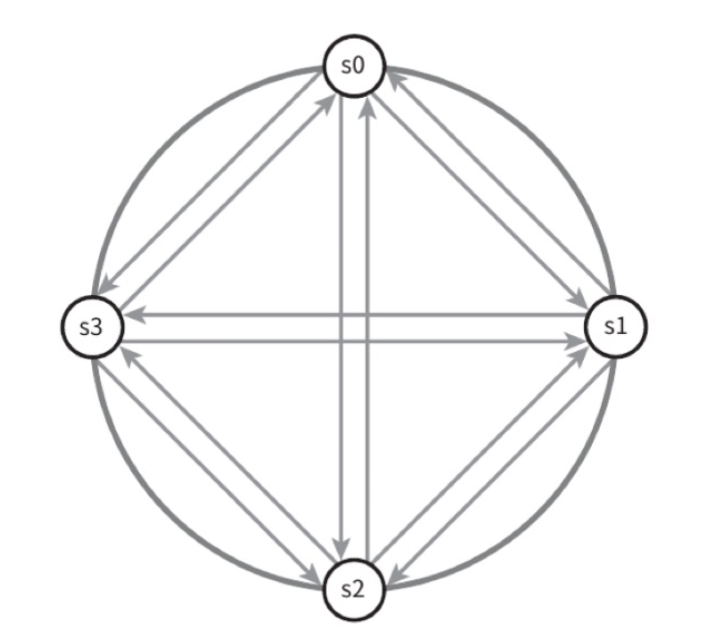

```
장애 감지를 위해 “멀티캐스팅 채널”을 구축한다는 건,
각 노드가 모든 다른 노드에게 주기적으로 ‘나 살아있어(heartbeat)’ 신호를 보내는 것
-> 노드 수가 많을수록 네트워크 부하가 기하급수적으로 커지고 확장성이 떨어지기 때문에 비효율적이라고 볼 수 있음. 
```

| 이유                 | 설명                                                        |
| ------------------ | --------------------------------------------------------- |
| **① 네트워크 부하 급증**   | 노드 수(N)가 늘어날수록 필요한 메시지 수가 **O(N²)** 으로 증가. 네트워크 트래픽이 폭증함. |
| **② 확장성 부족**       | 서버를 추가할 때마다 모든 노드가 새 노드와도 통신해야 함 → 노드 추가 시 설정/관리 복잡.      |
| **③ 장애 오탐 가능성 증가** | 모든 노드가 개별적으로 감지하므로 일시적인 네트워크 지연도 “장애”로 잘못 인식할 수 있음.       |
| **④ 리소스 낭비**       | 장애 감지 목적의 메시지가 너무 많아 CPU/네트워크 리소스를 소모하게 됨.                |

-> 가십 프로토콜 같은 분산형 장애 감지 솔루션이 더 효율적. 

**✔️ 가십 프로토콜**

**동작 원리**
1. 각 노드는 멤버십 목록을 유지. 멤버십 목록은 각 멤버의 ID와 그 박통 카운터 쌍의 목록.
2. 각 노드는 주기적으로 자신의 박동 카운터를 증가시킴.
3. 각 노드는 무작위로 선정된 노드들에게 주기적으로 자기 박동 카운터 목록을 보냄. 
4. 박동 카운터 목록을 받은 노드는 멤버십 목록을 최신 값으로 갱신.
5. 어떤 멤버의 박동 카운터 값이 지정된 시간 동안 갱신되지 않으면 해당 멤버는 장에(offline)인 것으로 간주. 

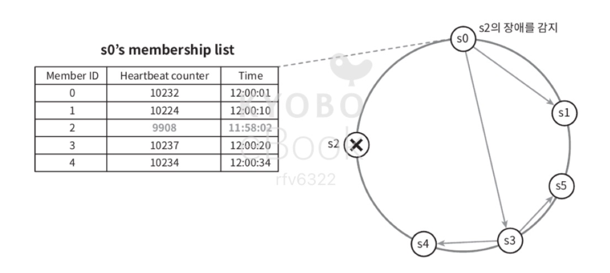

### 일시적 장애 처리

가십 프로토콜로 장애를 감지한 시스템은 가용성을 보장하기 위해 조치가 필요함.

**✔️ 느슨한 정족수 접근법** : 네트워크 일부 노드가 장애 상태여도, 남아 있는 정상 노드만으로 읽기·쓰기 연산을 수행하는 기법.
읽기/쓰기 연산을 금지하는 조건을 완화하여 가용성을 높임.
- 쓰기 연산을 수행할 W개의 건강한 서버와 읽기 연산을 수행할 R개의 건강한 서버를 해시 링에서 고름. 이 때 장애 상태인 서버는 무시.
- 해시 링(Hash Ring)에서 원래 요청을 담당해야 할 노드 중 일부가 장애 상태면, 그 다음 순서의 건강한 노드에게 요청을 위임함.
- 단, 나중에 장애 노드가 복구되면 데이터 재동기화 필요 (→ 아래 ‘임시 위탁 기법’과 연관)

**✔️ 임시 위탁 기법** : 장애 노드 대신 임시로 다른 노드가 요청을 처리하고, 나중에 원래 노드가 복구되면 변경분을 돌려주는 기법.
- 장애 서버로 가는 요청은 다른 서버에서 처리. 
- 그동안 발생한 변경사항은 서버가 복구되었을 때 일괄 반영 (일관성 보존).
- 이렇게 임시로 처리된 서버에는 그에 대한 단서(hint)를 남김.

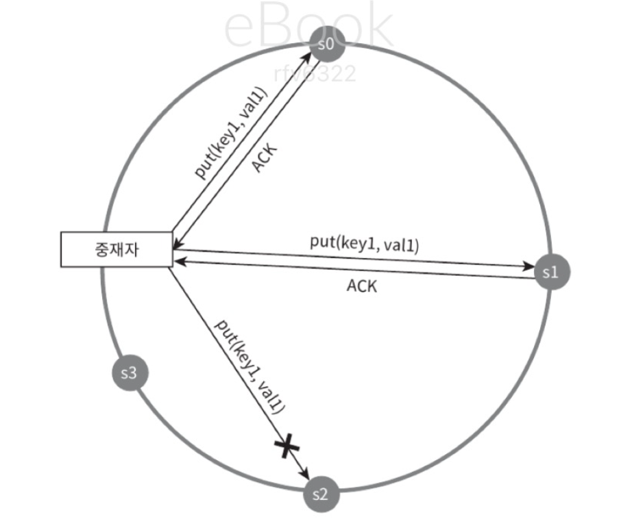

``` 
동작 방식
  - 장애 감지: A 노드가 죽었을 때, 원래 A가 담당하던 데이터를 B가 대신 저장함.
  - Hint 저장: B는 "이 데이터는 원래 A가 처리해야 했던 것"이라는 Hint(단서) 를 함께 저장함.
  - 복구 시점: A가 복구되면 B가 Hint를 보고 A에게 해당 데이터 변경분을 전송 → 일관성 회복.

주의할 점
  - 임시 노드에 저장된 Hint가 너무 많아지면 스토리지 부담 증가
  - 복구 시점에 Hint 전달 트래픽이 몰릴 수 있음 → 일시적 부하 스파이크
  - 따라서 대부분의 시스템은 Hint 만료 시간(TTL) 을 설정함 (예: 3시간~24시간)
  ```

### 영구 장애 처리

임시 위탁 기법은 일시적 장애를 처리하기 위한 것.
영구적인 노드의 장애 상태는 반-엔트로피 프로토콜을 구현하여 사본을 동기화함. 

**✔️ 반-엔트로피 프로토콜**
- 사본 간의 일관성이 망가진 상태를 탐지하고 전송 데이터의 양을 줄이기 위해서 머클 트리를 사용.
  - 머클 트리(해시 트리)는 각 노드에 그 자식 노드들에 보관된 값의 해시, 자식 노드들의 레이블로부터 계산된 해시 값을 레이블로 붙여주는 트리. 
  - 대규모 자료 구조 내용을 효과적이고 안전하게 검증 가능.

1단계 : 키 공간을 다음과 같이 버킷으로 나눔.  
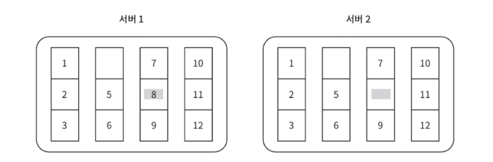

2단계 : 버킷에 포함된 각각의 키에 균등 분포 해시 함수를 적용하여 해시 값을 계산.
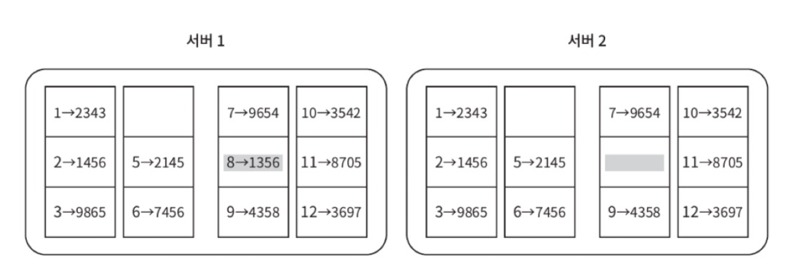

3단계 : 버킷 별로 해시 값을 계산한 후, 해당 해시 값을 레이블로 갖는 노드를 만듦.
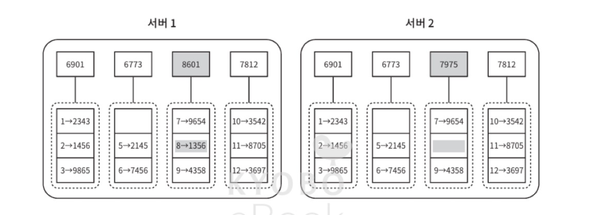

4단계 : 자식 노드의 레이블로부터 새로운 해시 값을 계산해서 이진 트리를 상향식으로 구성해 나감.


이 두 머클트리의 비교는 루트 노드의 해시 값을 비교하는 것에서 시작. 

- 루트노드의 해시 값이 일치한다면 두 서버는 같은 데이터를 갖는 것.
- 일치하지 않으면 왼쪽부터 오른쪽까지 자식 노드의 해시 값을 비교. 
- 아래쪽으로 계속 탐색하면서 다른 데이터를 갖는 버킷을 찾으면, 그 버킷들만 동기화하면 됨.

그러나, 실제 시스템의 경우 버킷 하나 당 크기가 꽤 크기 때문에 단순히 버킷 단위로 전체를 다시 복제(sync) 하는 것은 비효율적.    
-> 따라서 머클 트리를 활용한 시스템에서는, 버킷 내부에서도 데이터 조각 단위로 해시를 구성하여, 루트-리프 탐색을 통해 정확히 불일치가 발생한 부분만 선택적으로 동기화하도록 설계.  
-> 네트워크로 전송되는 데이터 양을 최소화하면서도, 데이터 정합성을 유지 가능.    
  이 방식은 대규모 분산 데이터베이스나 Dynamo류 시스템에서 Replica 간 Anti-Entropy 프로세스로 활용.

#### 데이터 센터 장애 처리

정전, 네트워크 장애, 자연 재해 등으로 발생 발생 가능. 다중화하는 것이 중요.

---

### 시스템 아키텍처 다이어그램

- 클라이언트는 키-값 저장소가 제공하는 두 가지 단순한 API, get/put과 통신.
- 중재자는 클라이언트에게 키-값 저장소에 대한 프록시 역할을 하는 노드.
- 노드는 안정 해시의 해시 링 위에 분포.

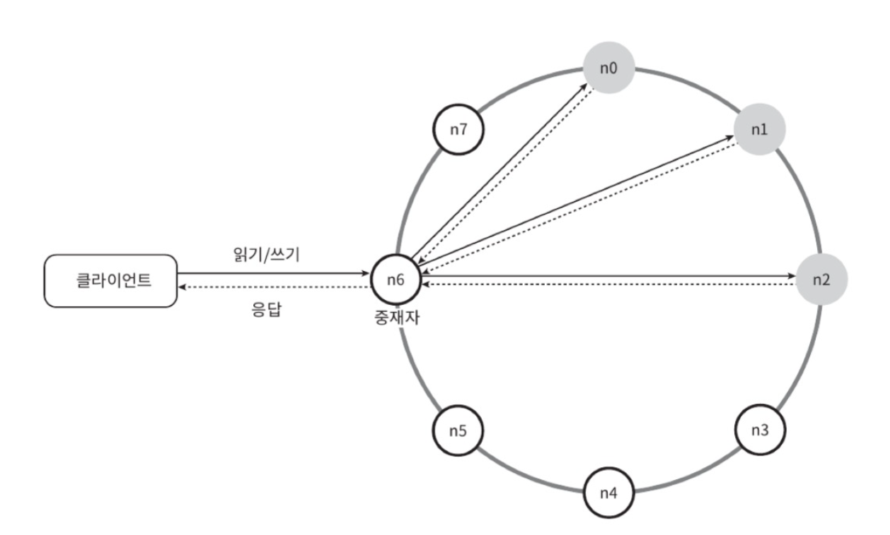

- 노드는 자동으로 추가/삭제할 수 있도록 하고, 시스템은 완전히 분산함. 
- 데이터는 여러 노드에 다중화됨.
- 모든 노드가 같은 책임을 지므로, SPOF는 존재하지 않음.

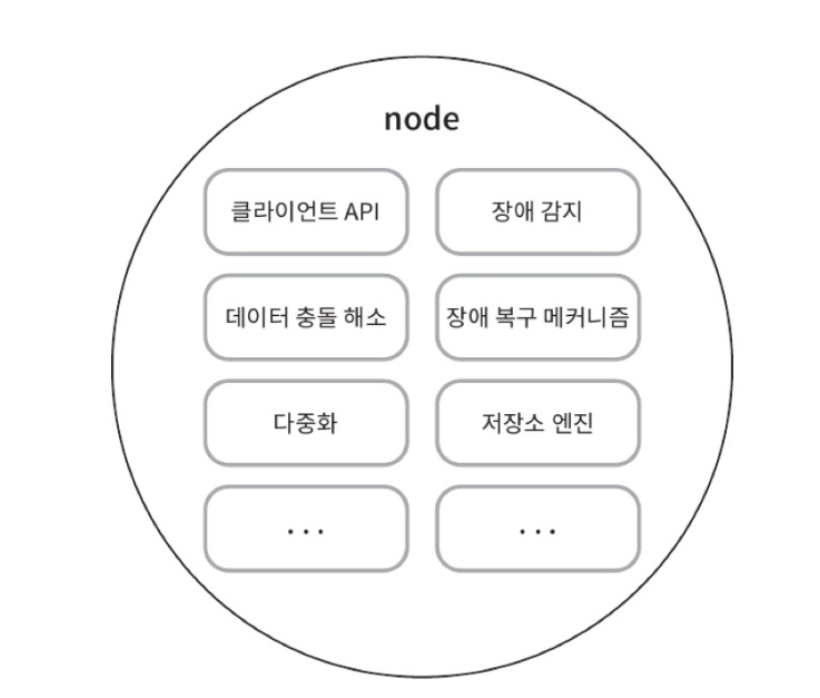

---

#### 쓰기 경로
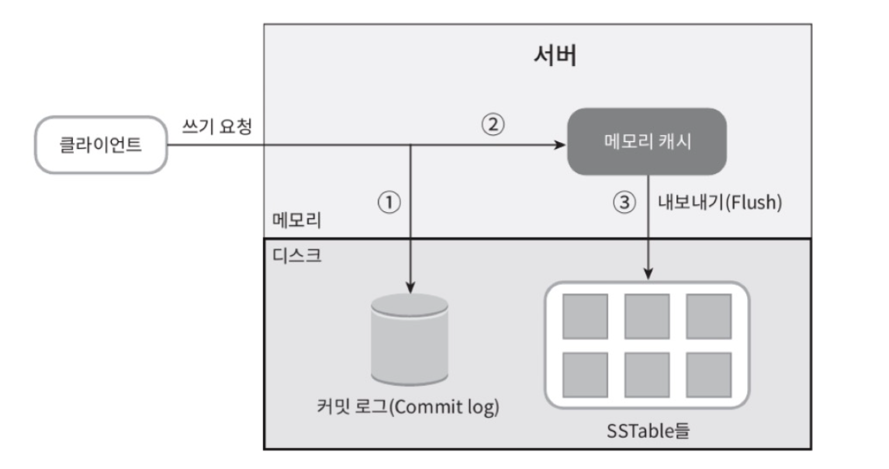

1. 쓰기 요청이 커밋 로그에 기록됨.
2. 데이터가 메모리 캐시에 기록됨.
3. 메모리 캐시가 가득차거나 사전에 정의된 어떤 임계치에 도달하면 데이터는 디스크에 있는 SSTable에 기록됨. 
   - SSTable은 <키-값> 의 순서쌍을 정렬된 리스트 형태로 관리하는 테이블. 

---

#### 읽기 경로

읽기 요청을 받은 노드는 데이터가 메모리 캐시에 있는지부터 살핌. 

- 있는 경우  
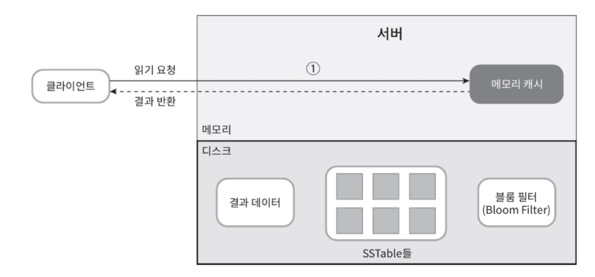

- 없는 경우  
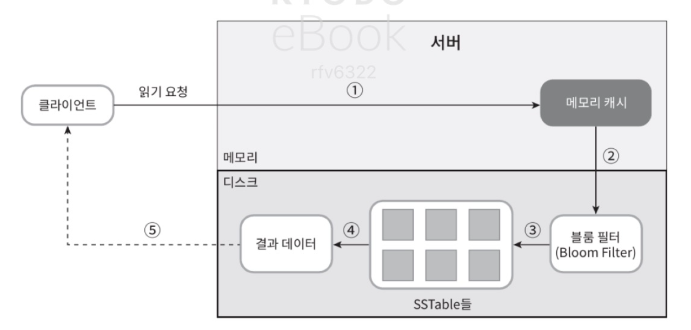
  - 어느 SSTable에 키가 있는지 알아내기 위해 블룸 필터 사용.
  
1. 데이터가 메모리에 있는지 검사.
2. 메모리에 없으므로 블룸 필터를 검사.
3. 블룸 필터를 통해 어떤 SSTable에 키가 보관되어 있는지 알아냄. 
4. SSTable에서 데이터를 가져옴.
5. 해당 데이터를 클라이언트에게 반환. 

```
블룸 필터(Bloom Filter)는 확률적 데이터 구조로, 이 값이 집합에 있는지 없는지를 빠르게 검사할 때 쓰이는 자료구조.

- 집합(Set) 데이터를 저장하지 않고 비트 배열(Bit Array) + 여러 해시 함수(Hash Function)만 사용.
- 장점: 메모리 효율적, 매우 빠른 조회.
- 단점: 거짓 양성(False Positive) 가능 → “있다”라고 나올 수 있지만 실제로는 없을 수 있음.
  - 하지만 거짓 음성(False Negative) 은 절대 없음 → “없다”라고 나오면 확실히 없음.
```

---

### 요약

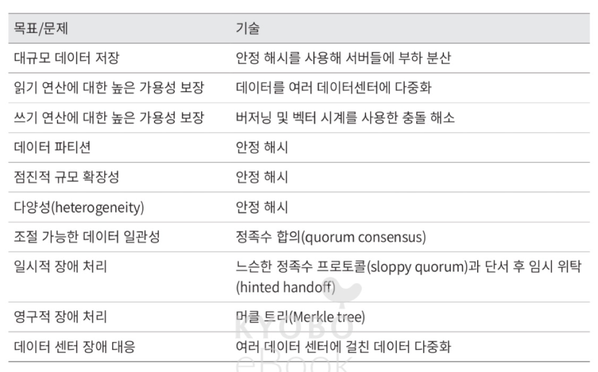