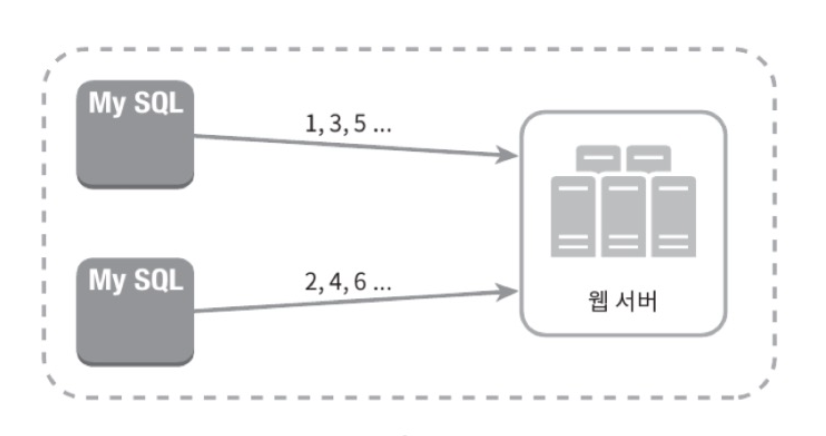
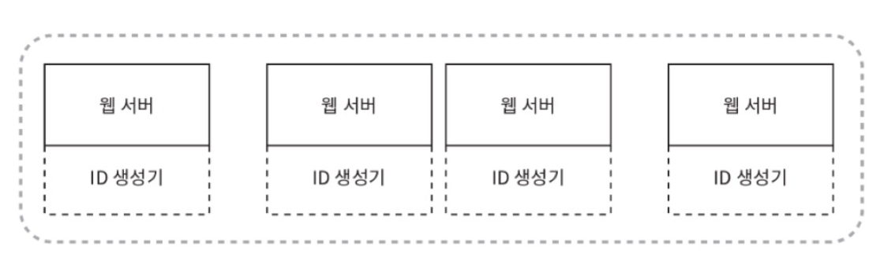
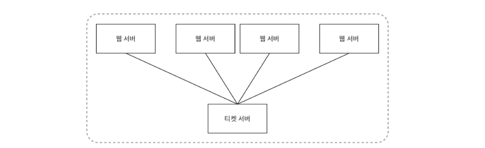
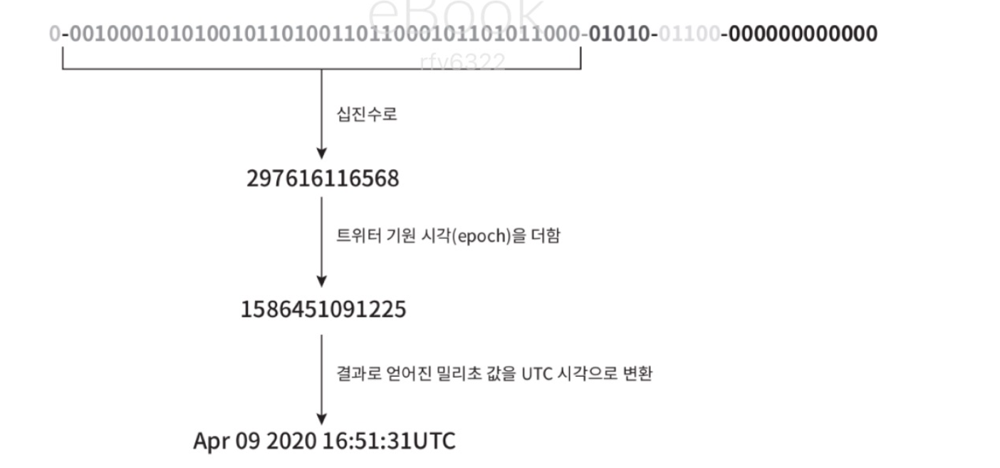

## 7. 분산 시스템을 위한 유일 ID 생성기 설계

### 1단계. 문제 이해 및 설계 범위 확정

- 먼저 결정해야 하는 것
    - ID는 어떤 특성을 갖는지? (유일성, 정렬 가능)
    - 새로운 레코드에 붙일 ID는 항상 1만큼 큰 값일지?
    - ID는 숫자로만 구성되는지?
    - 시스템의 규모는 어느 정도인지?

### 2단계. 개략적 설계안 제시 및 동의 구하기

- 다중 마스터 복제
- UUID
- 티켓 서버
- 트위터 스노플레이크 접근법

--- 

### (1). 다중 마스터 복제

데이터베이스의 auto_increment 기능을 활용한다. 단, 다음 ID 값을 구할 때 k만큼 증가시키고, 이 때 k는 현재 사용 중인 데이터베이스 서버의 수다.  
-> 규모 확장성 문제를 해결할 수 있지만, 여러 데이터 센터에 걸쳐 규모를 늘리기 어렵고 유일성은 보장되지만 그 값이 시간의 흐름에 맞추어 커지도록 보장할 수 없으며 서버를 추가하거나 삭제할 때에도 잘 동작하도록 만들기 어렵다.

### (2). UUID

UUID는 컴퓨터 시스템에 저장되는 정보를 유일하게 식별하기 위한 128비트짜리 수. 충돌 가능성이 지극히 낮은데, 중복 UUID가 1개 생길 확률을 50%로 끌어올리려면 초당 10억 개의 UUID를 100년 동안 계속해서 만들어야 한다.  
UUID는 서버 간 조율 없이 독립적으로 생성 가능하다.
각 웹서버는 별도의 ID 생성기를 이용해 독립적으로 ID를 만들어서 사용할 수 있다.

- 장점
    - 단순하고, 서버 사이의 조율이 필요 없으므로 동기화 이슈 역시 없다.
    - 각 서버에 ID 생성기가 각각 달려 있으므로 규모 확장이 쉽다.
- 단점
    - ID가 128비트로 길다.
    - 시간 순으로 정렬할 수 없다.
    - ID에 숫자가 아닌 값이 포함될 수 있다.

### (3). 티켓 서버

auto_increment 기능을 갖춘 데이터베이스 서버(티켓 서버)를 중앙 집중형으로 하나만 사용한다.

- 장점
    - 유일성이 보장되는 오직 숫자로만 구성된 ID를 쉽게 만들 수 있다.
    - 구현하기 쉽고, 중소 규모의 애플리케이션에 적합하다.
- 단점
    - 티켓 서버가 SPOF가 된다. 이 서버에 장애가 발생하면 모든 시스템이 영향을 받는다. 만약 이 문제를 피하기 위해 티켓 서버를 늘리면 데이터 동기화 같은 문제가 부차 발생한다.

#### (4). 트위터 스노플레이크 접근법

ID의 구조를 다음 그림과 같이 여러 섹션으로 분할한다.

- 사인 비트 : 1비트를 할당. 음수와 양수를 구별한다.
- 타임스탬프 : 41비트를 할당. 기원 시각 이후로 몇 밀리초가 경과했는지를 나타내는 값
- 데이터센터 ID : 5비트를 할당. 따라서 2^5, 32개 서버를 사용할 수 있다.
- 서버 ID : 5비트를 할당. 따라서 데이터 센터 당 32개 서버를 사용할 수 있다.
- 일련번호 : 12비트를 할당. 각 서버에서는 생성할 떄마다 이 일련번호를 1만큼 증가시킨다. 이 값은 1밀리초가 경과할 때마다 0으로 초기화된다.

### 3단계. 상세 설계

데이터센터 ID와 서버 ID는 시스템이 시작될 때 결정되고, 일반적으로 시스템 운영 중에는 바뀌지 않는다.   
데이터센터 ID나 서버 ID를 잘못 변경하면 ID 충돌이 발생할 수도 있으므로 신중해야 한다.   
타임스탬프, 일련 번호는 ID 생성기의 실행 중에 생성되는 값이다.

#### 타임스탬프

ID 구조 중 가장 중요한 41비트를 차지함. 시간에 따라 점점 큰 값을 갖게 되므로, 결국 ID는 시간 순으로 정렬 가능하게 된다.  
아래 그림은 ID 구조를 따르는 값의 이전 표현 형태로부터 시각을 추출하는 예제인데, 이 방법을 역이용하면 시각을 타임스탬프 값으로 변환할 수 있다.

41비트로 표현할 수 있는 타임스탬프의 최댓값은 2^41-1 밀리초. 대략 69년.  
-> 그러므로 69년 동안만 정상 작동하는데, 오버 플로가 발생하는 시점을 늦춰둔 것.  
69년이 지나면 기원 시각을 바꾸거나 ID 체계를 다른 것으로 이전해야 함.

#### 일련번호

12비트이므로 2^12 개의 값을 가질 수 있다.  
어떤 서버가 같은 밀리초 동안 하나 이상의 ID를 만들어낸 경우에만 0보다 큰 값을 갖게 된다.

### 4단계. 마무리

다중 마스터 복제, UUID, 티켓 서버, 트위터 스노플레이크 중 스노플레이크가 처음 설계한 요구사항을 만족하면서도 분산 환경에서의 규모 확정이 가능했음.

- 더 논의해보면 좋을 점
    - 시계 동기화 (전부 같은 시계를 사용한다고 가정했지만, 서버가 여러 코어에서 실행될 경우 유효하지 않을 수 있음)
    - 각 섹션의 길이 최적화 (특성에 따라 각 섹션의 길이를 조정할 수 있음. 동시성이 낮고 수명이 긴 경우 일련번호 길이를 줄이고 타임스탬프 길이를 늘리는 게 효과적일 수 있음)
    - 고가용성 (ID 생성기는 필수 불가결하므로 아주 높은 가용성을 제공해야 함)
