## 10. 알림 시스템 설계

- 알림 시스템
  - 모바일 푸시 알림
  - SMS 메시지
  - 이메일

### 1단계. 문제 이해 및 설계 범위 확정

- 먼저 결정해야 하는 것
    - 어떤 종류의 알림을 지원할 지
    - 실시간 시스템이어야 하는지
    - 어떤 종류의 단말을 지원할지
    - 알림은 누가 만드는지
    - 알림을 받지 않도록 설정할 수도 있어야 하는지
    - 하루에 몇 건의 알림을 보낼지

--- 

### 2단계. 개략적 설계안 제시 및 동의 구하기

### (1). 알림 유형별 지원 방안

- iOS 푸시 알림
  - 3가지 컴포넌트 필요.   
  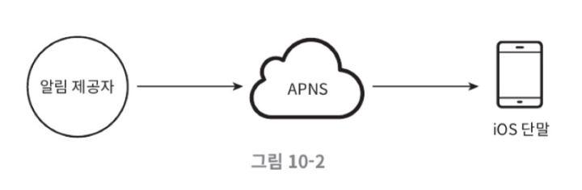
    - 알림 제공자 : 알림 요청을 만들어 애플 푸시 알림 서비스로 보내는 주체
      - 단말 토큰 : 알림 요청을 보내는 데 필요한 고유 식별자
      - 페이로드 : 알림 내용을 담은 json 딕셔너리
    - APNS : 애플이 제공하는 원격 서비스
    - iOS 단말 : 푸시 알림을 수신하는 사용자 단말

  
- 안드로이드 푸시 알림  
  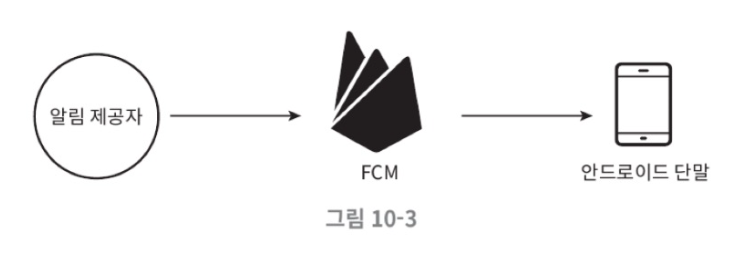
  - APNS 대신 FCM(Firebase Cloud Messaging) 사용

- SMS 메시지  
  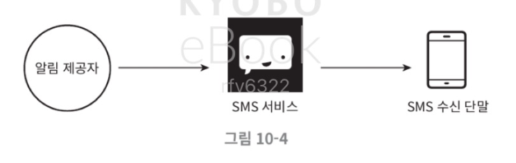
  - 트윌리오, 넥스모 같은 제 3사업자의 상용 서비스 이용

- 이메일  
  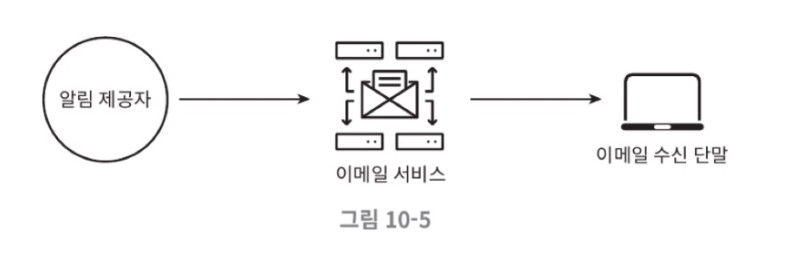
  - 상용 이메일 서비스 : Sendgrid, MailChimp

- 통합  
  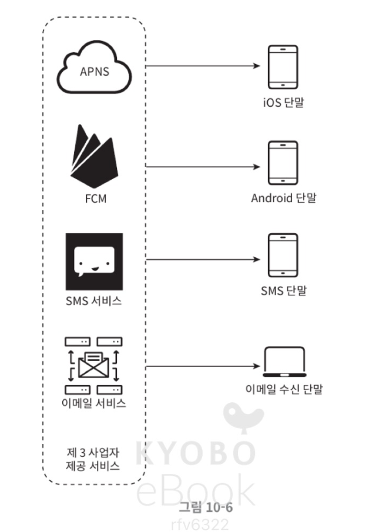

### (2). 연락처 정보 수집 절차

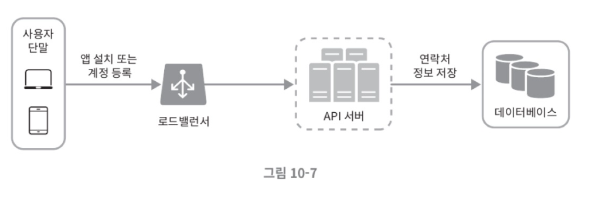

- 앱을 설치하거나 계정을 등록하면 API 서버에서는 해당 사용자의 정보를 수집해서 데이터베이스에 저장. 
- 이메일 주소, 전화번호는 user / 디바이스 토큰은 device에 저장하고 1:n으로 연결
  - 한 명의 사용자가 여러 개의 디바이스를 사용할 수 있고, 알림은 모든 디바이스에 전송되어야 하기 때문. 

### (3). 알림 전송 및 수신 절차

#### ➡️ 개략적 설계안

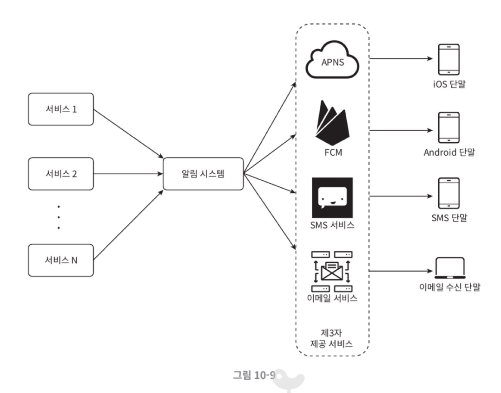

- 알림 시스템은 우선 1개만 사용
- 서버는 서비스 n개에 알림 전송을 위한 API 제공해야 하고 페이로드 만들 수 있어야 함
- 제3자 서비스는 사용자에게 알림을 실제로 전달하는 역할
- 확장성이 중요한데, FCM의 경우 중국에서 사용 못 하므로 JPush, Getui 등을 사용해야 함
  - 중국은 Google 서비스 대부분을 Great Firewall로 차단
  - 보통 실무 설계 구조 Global users -> FCM (Firebase) -> China users -> 중국 Push 서비스

#### ⚠️ 문제점

- SPOF : 서버가 1개
- 규모 확장성 X
- 성능 병목 

### ➡️ 개선한 개략적 설계안

- 데이터베이스와 캐시를 알림 시스템의 주 서버와 분리
- 알림 서버를 증설, 수평적 규모 확장 지원
- 메시지 큐를 이용해 시스템 컴포넌트 사이의 강한 결합 끊기

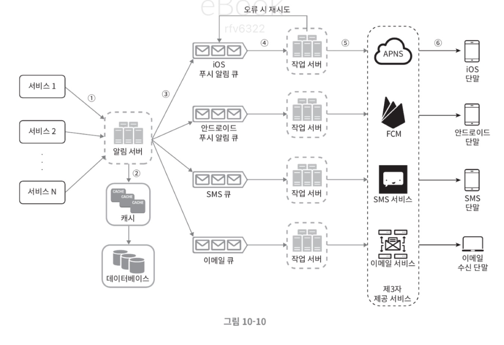

- 알림 서버
  - 알림 전송 API : 스팸 방지를 위해 사내 서비스로 사용하거나 인증된 클라이언트만 이용 가능
  - 알림 검증 : 이메일 주소, 전화번호에 대한 기본적 검증
  - 알림 전송 : 알림 데이터를 메시지 큐에 넣음 (병렬처리 가능)
- 캐시 : 사용자, 단말 정보와 알림 템플릿 캐시
- 메시지 큐 : 시스템 컴포넌트 간 의존성을 제거하기 위해서 사용 + 버퍼 역할

1. 앱 서버에서 알림 서버로 알림 요청
2. 알림 서버에서는 사용자 정보 조회한 뒤에 이벤트를 생성하고 메시지 큐에 넣음
3. 작업 서버가 메시지 큐에서 알림 이벤트를 꺼내고 제3자 push 서비스를 호출
4. 제3자 서비스(FCM, APNs)에서 사용자 디바이스로 알림 전송 

--- 

### 3단계. 상세 설계

#### (1). 안정성

- 데이터 손실 방지
  - 재시도 매커니즘이 중요  
  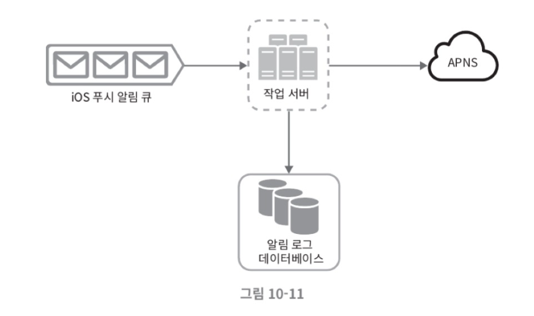

- 알림 중복 전송 방지
  - 이벤트 ID로 중복 체크
    1. 이벤트 수신
    2. eventId 확인
    3. 이미 존재하면 → 전송 안 함
    4. 없으면 → 알림 전송 + eventId 저장
  - 중복 전송을 100% 방지하는 것이 불가능한 이유 
    - 네트워크 오류, 재시도, 메시지 큐의 at-least-once 전달 특성 때문에 중복 전송을 완전히 제거하는 것은 불가능
    - 대신 idempotency와 deduplication으로 중복을 최소화

#### (2). 추가로 필요한 컴포넌트 및 고려사항

- 알림 템플릿 : 파라미터, 스타일, 추적 링크를 조정하기만 하면 됨. 형식 일관성 + 오류 방지 가능
- 알림 설정 : 알림 설정 테이블을 만들어서 알림 수신 여부 설정 가능
- 전송률 제한 
- 재시도 방법
- 푸시 알림과 보안
- 큐 모니터링
- 이벤트 추적  
  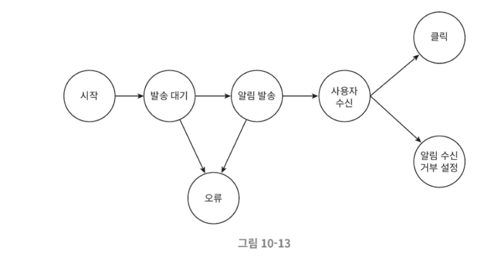

### ➡️ 수정된 설계안

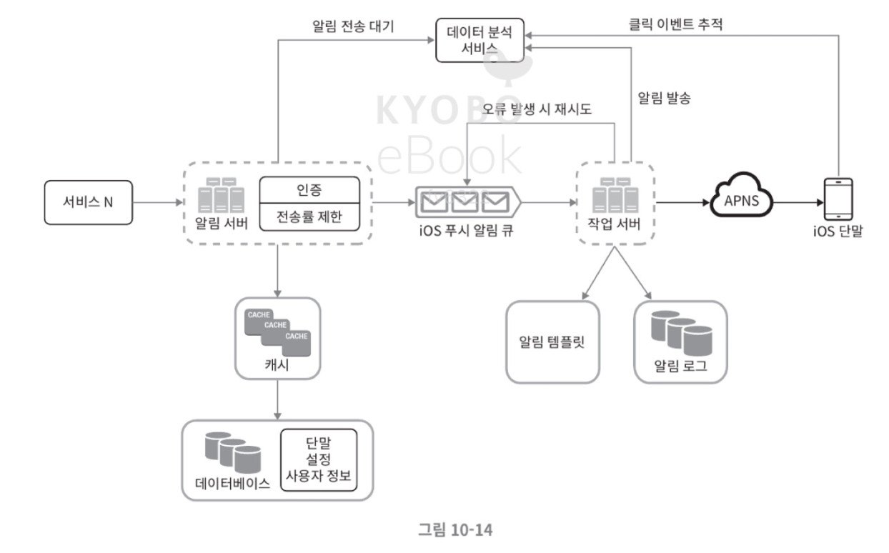

- 인증, 전송률 제한 기능 추가
- 재시도 기능 추가 (실패한 알림을 다시 큐에 넣어서 재시도)
- 전송 템플릿 사용
- 모니터링, 추적 시스템 추가

---

### 4단계. 마무리

- 집중한 내용
  - 안정적인 재시도 매커니즘
  - 보안 (appKey, appSecret 매커니즘)
  - 이벤트 추적 및 모니터링
  - 사용자 설정
  - 전송률 제한 (알림 빈도 제한)