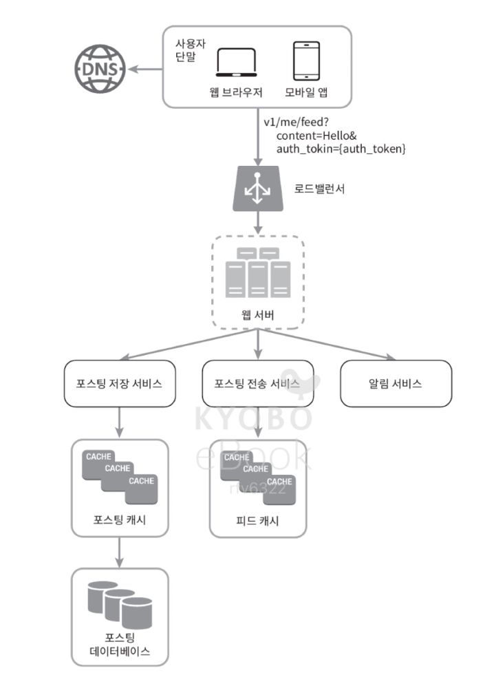
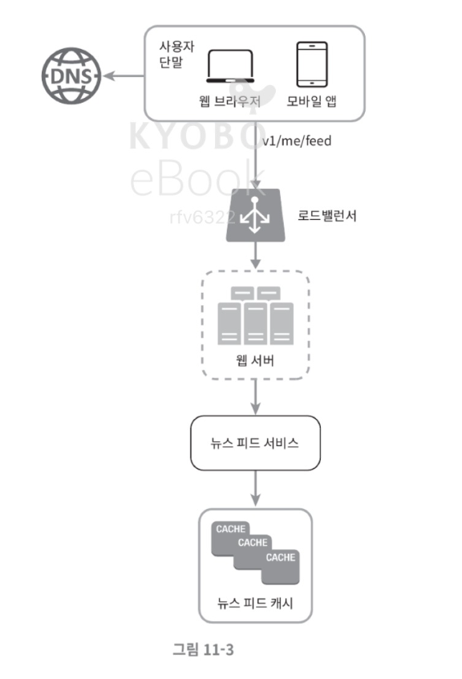
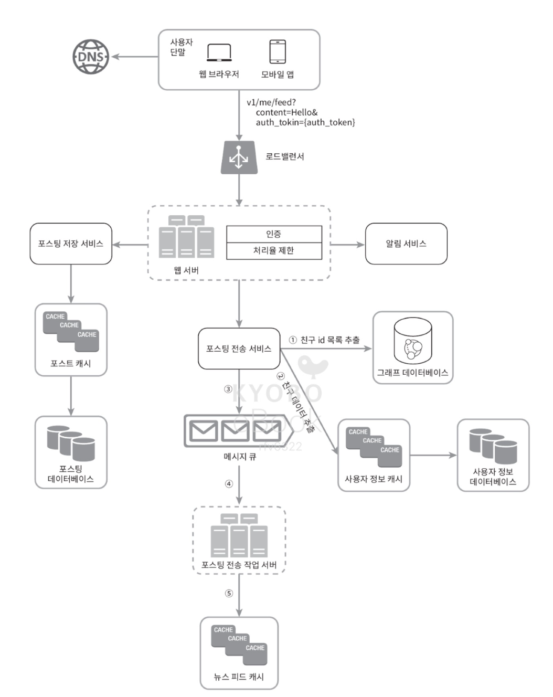
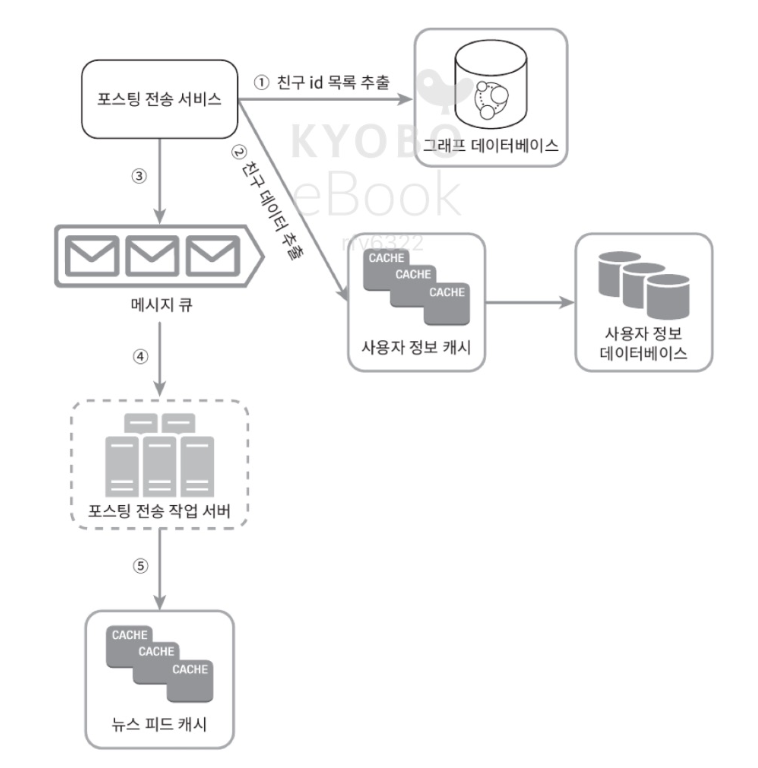
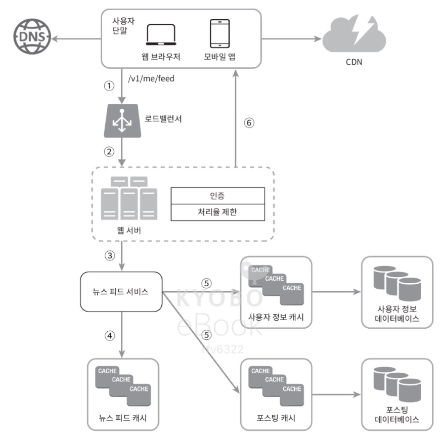
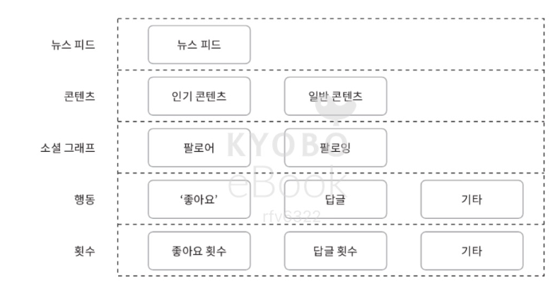

## 11. 뉴스 피드 시스템 설계

### 1단계. 문제 이해 및 설계 범위 확정

- 먼저 결정해야 하는 것
    - 앱/웹 지원 여부
    - 중요한 기능
    - 뉴스 피드 순서 정렬 방법
    - 사용자가 가질 수 있는 최대 친구 인원 수
    - 트래픽 규모
    - 피드 형식 (글, 이미지, 비디오 등)

--- 

### 2단계. 개략적 설계안 제시 및 동의 구하기

- 피드 발행 : 사용자가 스토리를 포스팅하면 해당 데이터를 캐시와 데이터베이스에 기록함. 새 포스팅은 친구의 뉴스 피드에도 전송됨.
- 피드 생성 : 지면 관게상 뉴스 피드는 모든 친구의 포스팅을 시간 흐름 역순으로 모아서 만든다고 가정.

### (1). 뉴스 피드 API

#### 1. 피드 발행 API (POST /v1/me/feed)
    - body : 포스팅 내용
    - Authorization 헤더
#### 2. 피드 읽기 API (GET /v1/me/feed)
    - Authorization 헤더

### (2). 피드 발행

  

- 포스팅 저장 서비스 : 새 포스팅을 데이터베이스와 캐시에 저장.
- 포스팅 전송 서비스 : 새 포스팅을 친구의 뉴스 피드에 push 한다. 뉴스 피드 데이터는 캐시에 보관하여 빠르게 읽어갈 수 있도록 함. 
- 알림 서비스 : 친구들에게 새 포스팅이 올라왔읆을 알리거나, 푸시 알림을 보내는 역할을 담당함. 

### (3). 뉴스 피드 생성

  

- 뉴스 피드 서비스 : 캐시에서 뉴스 피드를 가져옴. 
- 뉴스 피드 캐시 : 뉴스 피드를 랜더링할 때 필요한 피드 ID를 보관함

--- 

### 3단계. 상세 설계

### (1). 피드 발행 흐름 상세 설계

#### 🔘 웹 서버
- 클라이언트와 통신
- 인증, 처리율 제한
- 스팸을 막고 유해한 콘텐츠가 자주 올라오는 것을 방지하기 위해 한 사용자가 일정 기간 동안 올릴 수 있는 포스팅의 수에 제한을 두어야 함. 

#### 🔘 포스팅 전송 (팬아웃) 서비스

  

- 포스팅 전송, 즉 팬아웃은 어떤 사용자의 새 포스팅을 그 사용자와 친구 관계에 있는 모든 사용자에게 전달하는 과정. 
  - 팬아웃은 두 가지 모델이 있음
    1. 쓰기 시점에 팬아웃 (push 모델)
       - 포스팅이 완료되면 해당 사용자의 캐시에 포스팅을 기록
       - 장점 : 실시간으로 갱신되며 친구 목록에 있는 사용자에게 즉시 전송됨. pre-computed이므로 읽는 데 드는 시간이 짧아짐
       - 단점 : 친구가 많은 사용자의 경우 뉴스 피드 갱신이 오래걸림(hotkey). 서비스를 자주 이용하지 않는 사용자의 피드까지 갱신해야 하므로 자원 낭비됨. 
    2. 읽기 시점에 팬아웃 (pull 모델)
       - 피드를 읽어야 하는 시점에 뉴스 피드를 갱신. 요청 기반(on-demand) 모델. 
       - 장점 : 비활성화, 거의 사용하지 않는 사용자의 경우 이 모델이 유리, 로그인하기까지는 자원 소모 안 함. 데이터를 친구 각각에 push 하는 작업이 없으므로 핫키 문제 없음. 
       - 단점 : 뉴스 피드를 읽는 데 오래 걸림.

    
- 피드를 빠르게 가져오는 것이 중요하므로 대부분의 사용자에게는 push 모델을 사용하고, 팔로워/친구가 아주 많은 사용자의 경우에만 pull 모델을 사용하여 시스템 과부하를 방지.
- 안정 해시를 이용해 요청과 데이터를 고르게 분산해 핫키 문제 줄이기.  

1. 그래프 데이터베이스에서 친구 ID 목록 가져옴. 
2. 사용자 정보 캐시에서 친구들의 정보를 가져오고, 사용자 설정에 따라 친구 중 일부를 걸러냄(mute나 친한 친구 같은 기능).
3. 친구 목록과 새 스토리의 포스팅 ID를 메시지 큐에 넣음. 
4. 팬아웃 작업 서버가 메시지 큐에서 데이터를 꺼내 뉴스 피드 데이터를 뉴스 피드 캐시에 넣음. 사용자 정보와 포스팅 정보를 다 테이블에 저장하면 메모리 요구량이 지나치게 늘어날 수 있으므로 id만 저장. 또한 캐시에 제한을 두고 그 값을 조정할 수 있도록 한다. 
   - 대부분의 사용자가 보려고 하는 것은 최신 스토리로, 모든 스토리를 보려고 하진 않으므로 캐시 미스가 일어날 확률이 낮음.

#### (2). 피드 읽기 흐름 상세 설계

1. 뉴스 피드를 읽기 요청
2. 로드밸런서가 요청을 서버 중 하나로 보냄 
3. 웹 서버가 뉴스 피드 서비스를 호출
4. 뉴스 피드 캐시에서 포스팅 목록 ID를 가져옴
5. 뉴스 피드에 표시할 사용자 이름, 사진, 포스팅 콘텐츠, 이미지 등을 사용자 캐시와 포스팅 캐시에서 가져와 완전한 뉴스 피드를 만듦
6. 생성된 뉴스 피드를 json 형태로 클라이언트에게 보냄. 클라이언트는 해당 피드를 랜더링함.

#### 🔘 캐시 구조

- 뉴스 피드 : 뉴스 피드의 ID
- 콘텐츠 : 포스팅 데이터
- 소셜 그래프 : 사용자 간 관계 정보
- 행동 : 포스팅에 대한 사용자의 행위 정보
- 횟수 : 좋아요, 응답, 팔로워, 팔로잉 수

---

### 4단계. 마무리

- 더 논의해보면 좋을 주제
  - 데이터베이스 규모 확장
    - 수직/수평적 규모 확장
    - SQL vs NoSQL 
    - 주/부 다중화
    - 복제본에 대한 읽기 연산
    - 일관성 모델
    - 데이터베이스 샤딩
  - 웹 계층을 무상태로 운영하기
  - 가능한 많은 데이터를 캐시할 방법
  - 여러 데이터 센터를 지원할 방법
  - 메시지 큐를 사용하여 컴포넌트 사이의 결합도 낮추기
  - 핵심 메트릭에 대한 모니터링