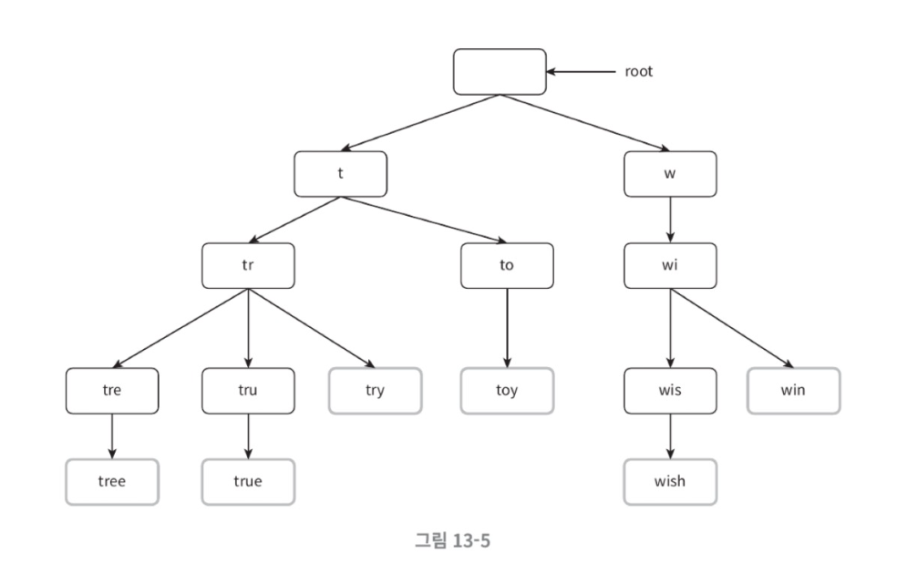
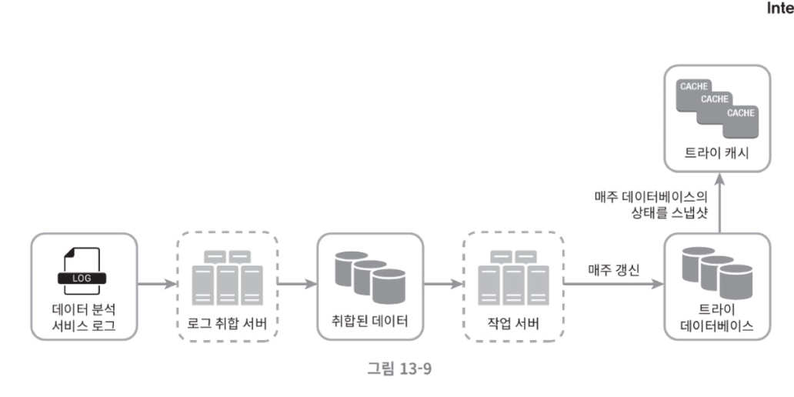
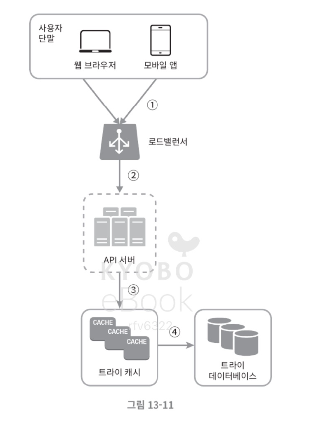

## 13. 검색어 자동완성 시스템

### 1단계. 문제 이해 및 설계 범위 확정

- 먼저 결정해야 하는 것
    - 사용자가 입력하는 단어가 자동완성될 검색어의 어느 부분인지
    - 몇 개의 자동완성 검색어를 표시할지
    - 자동완성 검색어를 고르는 기준
    - 맞춤법 검사 기능 제공 여부
    - 질의 언어
    - 대문자, 특수 문자 처리 여부
    - 얼마나 많은 사용자를 지원해야 하는지

--- 

### 2단계. 개략적 설계안 제시 및 동의 구하기

시스템은 두 부분으로 나뉨   
    - 데이터 수집 서비스   
    - 질의 서비스  

### (1). 데이터 수집 서비스

빈도 테이블은 사용자들이 질의를 할 때마다 실시간으로 바뀔 것

### (2). 질의 서비스

- query : 질의문을 저장
- frequency : 질의문 빈도를 저장

가장 많이 사용된 검색어는 SQL 질의문으로 계산할 수 있지만 데이터가 많아지면 병목이 될 수 있음.

--- 

### 3단계. 상세 설계

### (1). 트라이 자료구조

- 핵심 아이디어 
  - 트라이는 트리 형태의 자료 구조
  - 트리의 루트 노드는 빈 문자열을 나타냄 
  - 각 노드는 글자 하나를 저장하며, 26개의 자식 노드를 가질 수 있음
  - 각 트리 노드는 하나의 단어, 접두여 문자열을 나타냄

  

- 가장 많이 사용돤 질의어 k개 찾기
  1. 해당 접두어를 표현하는 노드 찾기 
  2. 해당 노드부터 시작하는 하위 트리 탐색해서 유효 노드 찾기
  3. 유료노드를 정렬해서 가장 인기 있는 검색어 k개 찾기  
-> 시간 복잡도는 O(p)+O(c)+O(clogC)
  

- but 최악의 경우 전체 트리를 검색해야 할 수 있음
- 접두어의 최대 길이를 제한 
- 각 노드에 인기 검색어를 캐시

### (2). 데이터 수집 서비스

- 규모 확장이 쉬우려면 다음과 같이 수정해야 함

### (2). 데이터 분석 서비스 로그

- 로그 취합 서버
  - 데이터를 잘 취합aggregation하여 시스템이 쉽게 소비할 수 있게 해야함. 
  - 취합 주기 짧게 가져가기. 

- 작업 서버는 주기적으로 비동기 작업을 실행하는 서버 집합. 트라이 구조를 만들고 DB에 저장하는 역할. 
- 트라이 캐시는 분산 캐시 시스템으로 트라이 데이터를 메모리에 유지하여 읽기 연산 성능을 높임. 
- 트라이 베이스는 지속성 저장소로, 아래 두가지가 있음. 
  - 문서 저장소 / 키-값 저장소

### (3). 질의 서비스

#### ➡️ 수정된 설계안

1. 검색 질의가 로드밸런서로 전송됨
2. 로드밸런서는 질의를 api 서버로 보냄
3. api 서버는 트라이 캐시에서 데이터를 가져와서 자동완성 검색어 제안 응답을 구성
4. 캐시 미스가 나는 경우 데이터를 db에서 가져와서 채움

#### 추가적으로 생각해보면 좋을 것

1. AJAX 요청 : 웹 애플리케이션의 경우 브라우저는 보통 AJAX 요청을 보내서 자동완성된 검색어 목록을 가져옴. 
2. 브라우저 캐싱 : 제안된 검색어들을 브라우저 캐시에 넣어두면 후속 질의 결과는 바로 가져올 수 있음. (구글 엔진이 이런 메커니즘을 사용)
3. 데이터 샘플링 : N개 요청 가운데 1개만 로깅하도록 함

### (4). 트라이 연산

- 트라이 생성은 작업 서버가 담당
- 트라이 갱신 
  1. 매주 한 번 갱신 
  2. 트라이의 각 노드를 개별적으로 갱신 

#### 검색어 삭제
- 트라이 캐시 앞에 필터 계층을 두고 부적절한 질의어가 반환되지 않도록 할 수 있음

#### 저장소 규모 확장 
- 과거 질의 데이터의 패턴을 분석해서 샤딩하는 방법

---

### 4단계. 마무리

- 더 생각해보면 좋을 내용
  - 다국어 지원이 가능하도록 하려면? : 트라이에 유니코드를 저장해야 함
  - 국가마다 인기 검색어 순위가 다르면? : 국가별로 다른 트라이 사용
  - 실시간으로 변하는 추이를 반영하려면? : 현 설계안에는 적합하지 않음. 아래와 같은 내용을 고려해보기
    - 샤딩을 통해 대상 데이터 양을 줄이기
    - 순위 모델을 바꿔서 최근 검색어에 보다 높은 가중치 두기
    - 데이터가 스트림 형태로 올 수 있다는 점을 고려해야 함